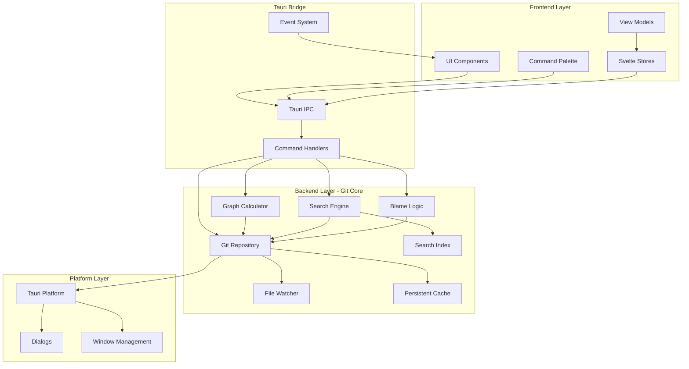
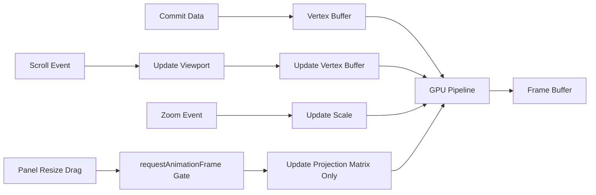

# Design Document: gitv

> **Note**: This is the active design document. The original React-based spec is preserved in `.kiro/specs/gitv/design.md`. New requirements (35-41) have been merged into the root `requirements.md`.

## Overview

gitv is a modern, cross-platform Git visualization tool built with Rust and Tauri. It serves as a contemporary reimplementation of gitk, providing an intuitive graphical interface for exploring Git repositories. Unlike gitk, which is typically launched from within a repository, gitv allows users to launch the application independently and open any Git project directory.

### Design Goals

1. **Performance First**: Handle repositories with 100,000+ commits smoothly with 60 FPS rendering; cold start under 500ms; indexed search under 100ms
2. **Pure Rust**: Use Rust for all application code, preferring pure-Rust crates (especially gitoxide for Git operations)
3. **Modern UX**: Provide a polished, responsive experience with smooth animations and intuitive navigation
4. **Gitk Compatibility**: Maintain the dense, information-rich commit graph alignment that gitk users expect
5. **Decoupled Architecture**: Separate Git logic from UI for maintainability and testability
6. **Lightweight**: Binary under 15MB; zero network dependency; persistent cache for instant re-open

### Key Differentiators from gitk

- Independent application launch with repository picker
- Modern GPU-accelerated rendering
- Cross-platform consistency
- Streaming data loading for large repositories
- Command palette for quick navigation
- Manual refresh with toolbar button
- Persistent graph cache for instant re-open
- Reflog visualization and stash browsing

---

## Architecture

### High-Level Architecture



### Layer Responsibilities

| Layer | Responsibility | Technology |
|-------|----------------|------------|
| Frontend | UI rendering, user interaction, state management | Svelte 5 + TypeScript |
| Tauri Bridge | IPC communication, command routing, event broadcasting | Tauri 2.0 |
| Backend (Git Core) | Git operations, graph calculation, search, refresh, caching | Rust + gix (gitoxide) |
| Platform | Native dialogs, window management, filesystem access | Tauri + OS APIs |

### Architectural Decisions

#### ADR-001: Decoupled Git Backend

**Decision**: The Git backend module is a completely separate Rust crate with no UI dependencies.

**Rationale**:
- Enables independent testing of Git logic (Req 23.4)
- Allows future replacement of the Git implementation (Req 23.6)
- Provides clean API boundaries (Req 23.2)
- No Tauri-specific dependencies in Git code (Req 23.5)

**Consequences**:
- Clear separation between `gitv-git-core` and `gitv-app` crates
- Git backend exposes trait-based interfaces for mocking in tests
- UI communicates only through well-defined data structures

#### ADR-002: Pure Rust Git Implementation

**Decision**: Use gitoxide (gix crate) as the primary Git library.

**Rationale**:
- Pure Rust implementation (Req 30.1, 30.3)
- Production-grade stability with active development
- Supports commit graph traversal, blame, status, and most read operations
- No external C library dependencies for core functionality

**Fallback**: If gitoxide lacks specific features, we may need to:
1. Contribute the feature upstream to gitoxide
2. Implement missing functionality directly in gitv
3. Shell out to `git` CLI as a last resort (clearly documented per Req 30.4)

#### ADR-003: Canvas 2D Graph Rendering

**Decision**: Use Canvas 2D for commit graph rendering.

**Rationale**:
- Canvas 2D provides excellent performance for virtualized graph rendering
- No native dependencies or GPU driver concerns
- Works within Tauri window context
- Simple, reliable rendering pipeline

#### ADR-004: Multi-Instance Architecture

**Decision**: Each repository opens in its own independent window (multi-instance), not as tabs in a shared window.

**Rationale**:
- Each window has fully isolated state — no tab-store abstraction needed
- Multiple repos can be viewed side-by-side across monitors
- Process isolation: one crashed window doesn't take down others
- Simpler implementation: each window is a fresh Svelte app with its own stores
- No inter-instance IPC or tab serialization logic required

**Consequences**:
- Taskbar shows multiple entries for multiple repos
- Higher total memory than tab-based approach
- Shared persistent data (preferences, recent repos cache) read/written independently by each instance

#### ADR-005: Branch View Filtering Architecture (Req 32)

**Decision**: Branch view filtering is implemented at the Git traversal layer, not the UI layer.

**Rationale**:
- Filtering at traversal layer ensures we never load unnecessary commits
- First-parent-only traversal is a pure Git operation
- UI remains responsive with pre-filtered data
- Consistent with existing streaming architecture

**Implementation**:
- `CommitFilter` struct extended with `branch_view_mode`
- First-parent-only uses `gix::traverse::commit::ancestors()` with `parents::first()` mode
- Single-branch mode uses reachability check from branch tip

#### ADR-006: SvelteKit with Static Adapter

**Decision**: Use SvelteKit with Svelte 5 as the frontend framework, with static adapter for Tauri.

**Rationale**:
- Svelte compiles to vanilla JS — no runtime framework overhead
- Svelte 5 runes (`$state`, `$derived`, `$effect`, `$props`) provide fine-grained reactivity without virtual DOM
- Built-in stores eliminate need for external state management library
- SvelteKit provides file-based routing; static adapter produces a SPA for Tauri
- Smaller bundle size than React, important for desktop app startup time

**Consequences**:
- Frontend uses `+page.svelte` / `+layout.svelte` file conventions
- State lives in `src/lib/stores/` as Svelte stores (writable/readable/derived)
- Component props use `let { ... } = $props()` rune
- No virtual DOM diffing; Svelte updates DOM directly at compile time

#### ADR-007: Binary IPC Serialization

**Decision**: Use postcard (or equivalent compact binary serializer) for commit batch streaming over Tauri IPC.

**Rationale**:
- JSON serialization of 100k+ commits is the dominant IPC cost: each `CommitInfo` has multiple string fields, `Vec` fields, and `DateTime` strings
- Binary serialization is 3-5x smaller and 5-10x faster to serialize/deserialize than JSON for structured data with many small fields
- Tauri IPC supports raw byte transfer; postcard produces compact output with no schema overhead
- Performance budget: batch of 100 commits serialized + deserialized in <1ms

**Consequences**:
- Frontend must deserialize binary buffers (using a generated TS decoder matching the Rust types)
- Tauri IPC commands for streaming use `Vec<u8>` return type instead of typed structs
- Non-streaming commands (single commit detail, repo info) can still use JSON for simplicity

#### ADR-008: Persistent Graph Cache

**Decision**: Cache computed graph layout and commit metadata to disk for instant repository re-open.

**Rationale**:
- Re-opening a previously visited repository should be near-instant, not require full re-traversal
- Graph layout calculation is O(n log n) — wasteful to repeat for unchanged topology
- Git's own `commit-graph` file (`objects/info/commit-graph`) provides generation numbers for faster traversal; we should leverage it when available
- Cache invalidation is straightforward: compare stored ref tips to current ref tips; incremental update only if changed

**Implementation**:
- Cache stored at `$XDG_DATA_DIR/gitv/cache/<repo-hash>/` (platform-appropriate)
- Stores: pre-computed `GraphLayout`, commit summaries, ref snapshot at cache time
- On open: load cache, diff ref tips. If unchanged, use cache directly. If changed, traverse only new commits and append incrementally
- Stale cache entries evicted by LRU (max 20 repos cached)

**Consequences**:
- First open of a repo still requires full traversal
- Subsequent opens are near-instant (<100ms for cached data)
- Cache directory may grow; needs eviction policy
- Cache format must be versioned for forward compatibility

---

## Components and Interfaces

### Backend Components (Rust)

#### Git Repository Module (`gitv-git-core::repository`)

```rust
/// Unique object identifier — 20-byte binary SHA-1, not a hex string.
/// Display via `.to_hex()` for UI rendering; compare/index as raw bytes.
#[derive(Clone, Copy, PartialEq, Eq, Hash)]
pub struct Oid([u8; 20]);

impl Oid {
    pub fn from_hex(s: &str) -> Result<Self, OidError>;
    pub fn to_hex(&self) -> String;
    pub fn short_hex(&self) -> String;
    pub fn as_bytes(&self) -> &[u8; 20];
}

/// Core repository abstraction - the main entry point for Git operations
pub struct Repository {
    inner: gix::Repository,
    path: PathBuf,
}

/// Repository information for display
pub struct RepositoryInfo {
    pub path: PathBuf,
    pub head_branch: Option<String>,
    pub head_commit: Option<Oid>,
    pub is_bare: bool,
    pub worktree_status: WorktreeStatus,
}

/// Worktree status summary
pub struct WorktreeStatus {
    pub staged_count: usize,
    pub unstaged_count: usize,
    pub ahead: usize,
    pub behind: usize,
}

impl Repository {
    /// Open a repository at the given path
    pub fn open(path: &Path) -> Result<Self, RepositoryError>;

    /// Check if a path contains a Git repository
    pub fn is_repository(path: &Path) -> bool;

    /// Get repository information
    pub fn info(&self) -> RepositoryInfo;

    /// Stream commits with optional filters
    pub fn stream_commits(&self, filter: CommitFilter) -> impl Stream<Item = Commit>;

    /// Get all refs (branches, tags, remotes)
    pub fn refs(&self) -> Result<Vec<Ref>, GitError>;

    /// Get commit details
    pub fn commit(&self, oid: Oid) -> Result<CommitDetails, GitError>;

    /// Get diff summary (file list + stats, no hunk content) — Req 61.1
    pub fn diff_summary(&self, from: Oid, to: Oid) -> Result<DiffSummary, GitError>;

    /// Get diff hunks for a single file — Req 61.2
    /// Applies per-file line-count limit with truncation info
    pub fn file_diff(&self, from: Oid, to: Oid, path: &Path) -> Result<FileDiff, GitError>;

    /// Get file history/blame
    pub fn blame(&self, path: &Path) -> Result<Blame, GitError>;

    /// Search commits
    pub fn search(&self, query: SearchQuery) -> Result<Vec<SearchResult>, GitError>;

    /// Get file history following renames (--follow semantics)
    pub fn file_history_follow(
        &self,
        path: &Path,
        max_count: Option<usize>,
    ) -> Result<Vec<FileHistoryEntry>, GitError>;

    /// Get reflog entries
    pub fn reflog(&self, ref_name: Option<&str>) -> Result<Vec<ReflogEntry>, GitError>;

    /// Get stash list — each entry includes parent_oid for graph marker placement
    /// and file_summary for hover tooltip (Req 38.1, 38.8)
    pub fn stash_list(&self) -> Result<Vec<StashEntry>, GitError>;

    /// Get stash diff — returns combined diff (like `git stash show -p`)
    /// Uses standard +/- markers, not gitk's double +/- display (Req 38.3)
    pub fn stash_diff(&self, stash_index: usize) -> Result<Diff, GitError>;

    /// Get stash split diff — returns staged and unstaged diffs separately
    /// Used by the detail panel toggle (Req 38.4)
    pub fn stash_split_diff(&self, stash_index: usize) -> Result<StashSplitDiff, GitError>;

    /// Get diff of uncommitted changes — returns empty/none for bare repos (Req 65.2)
    pub fn working_changes_diff(&self) -> Result<WorkingChangesDiff, GitError>;

    /// Get file tree at a specific commit (or HEAD if None).
    /// For bare repositories, always returns the HEAD tree — no working directory access (Req 65.5).
    pub fn file_tree(&self, at_commit: Option<Oid>) -> Result<FileTreeNode, GitError>;

    /// Get file contents at a specific commit
    /// Get file contents at a specific commit — returns FileContents enum to handle binary (Req 60)
    pub fn file_contents(&self, path: &Path, at_commit: Option<Oid>) -> Result<FileContents, GitError>;
}
```

#### Graph Calculator Module (`gitv-git-core::graph`)

```rust
/// Calculates the visual layout of the commit graph
pub struct GraphCalculator {
    commits: Vec<CommitInfo>,
    refs: HashMap<Oid, Vec<Ref>>,
    stashes: Vec<StashEntry>,
    options: GraphOptions,
}

pub struct GraphOptions {
    pub hide_merges: bool,
    pub orientation: GraphOrientation,
    pub color_mode: GraphColorMode,
}

pub enum GraphOrientation {
    TopToBottom,
    BottomToTop,
}

pub enum GraphColorMode {
    ByBranch,
    ByAuthor,
}

pub enum ColorPalette {
    Default,
    Deuteranopia,
    Protanopia,
    Tritanopia,
}

pub enum Theme {
    Dark,
    Light,
}

/// Language preference with extensible custom codes.
/// Known variants serialize as their kebab-case code; unknown codes
/// round-trip through Custom(String). Frontend discovers available
/// translations via `import.meta.glob` on `locales/*.json`.
pub enum Language {
    En,       // "en"
    ZhCn,     // "zh-cn"
    Custom(String),
}

impl Language {
    pub fn code(&self) -> &str { /* ... */ }
}

// Custom Serialize/Deserialize: always a plain JSON string ("en", "zh-cn", "de", etc.)

/// Node position in the graph (row = i-coordinate, column = j-coordinate)
pub struct NodePosition {
    pub oid: Oid,
    pub row: usize,
    pub column: usize,
    pub is_merge: bool,
    pub is_stash: bool,
    pub color: Color,
    pub is_dimmed: bool,
    pub is_highlighted: bool,
}

/// Stash node placed in the graph with its own row and a branch-out edge to parent
pub struct StashMarker {
    pub row: usize,
    pub column: usize,
    pub stash_index: usize,
    pub stash_oid: Oid,
    pub parent_oid: Oid,
    pub message: String,
}

/// Edge between commits in graph coordinates
pub struct Edge {
    pub from_row: usize,
    pub from_col: usize,
    pub to_row: usize,
    pub to_col: usize,
    pub edge_type: EdgeType,
    pub color: Color,
    pub is_dimmed: bool,
    pub edge_style: EdgeStyle,
}

pub enum EdgeType {
    Straight,
    Branch,
    Merge,
}

/// Non-color visual indicator for branch type (accessibility)
pub enum EdgeStyle {
    Solid,
    Dashed,
    Dotted,
}

/// Complete graph layout ready for rendering
pub struct GraphLayout {
    pub nodes: Vec<NodePosition>,
    pub stash_markers: Vec<StashMarker>,
    pub stash_commits: Vec<CommitInfo>,
    pub edges: Vec<Edge>,
    pub total_columns: usize,
    pub orientation: GraphOrientation,
    pub total_rows: usize,
}

impl GraphCalculator {
    /// Create calculator from commit stream, stash entries, and options
    pub fn new(
        commits: Vec<CommitInfo>,
        refs: HashMap<Oid, Vec<Ref>>,
        stashes: Vec<StashEntry>,
        options: GraphOptions,
    ) -> Self;

    /// Calculate graph layout using temporal topological sort
    /// Based on algorithm from https://pvigier.github.io/2019/05/06/commit-graph-drawing-algorithms.html
    /// Stash markers are placed on their parent commit rows after layout calculation.
    /// When hide_merges is true, merge commits are excluded and edges reconnect
    /// through the hidden merge to its first parent (Req 53.3).
    /// Merge+branch preservation: merges with 2+ non-merge children are kept
    /// (they are branch points). Processed in ascending row order so kept merges
    /// cascade — a kept merge counts as a visible child of its own merge parents.
    /// Source-orphan guard: an edge is not removed if its source would be left
    /// with zero outgoing edges.
    /// When orientation is BottomToTop, rows are reversed (Req 57.3).
    /// When color_mode is ByAuthor, author_colors is populated instead of branch_colors (Req 52).
    pub fn calculate_layout(&self) -> GraphLayout;

    /// Get visible portion of the graph for virtualization
    pub fn visible_range(&self, start_row: usize, end_row: usize) -> GraphViewport;

    /// Apply dimming to nodes not matching the filter criteria (Req 56)
    pub fn apply_dimming(&mut self, selected_oid: Option<Oid>, matching_oids: Option<&HashSet<Oid>>);
}
}
```

#### Search Engine Module (`gitv-git-core::search`)

```rust
/// Search query with multiple criteria
pub struct SearchQuery {
    pub text: Option<String>,
    pub sha_prefix: Option<String>,
    pub author: Option<String>,
    pub date_range: Option<DateRange>,
    pub file_path: Option<PathBuf>,
    pub diff_pattern: Option<Regex>,
    pub combine_mode: CombineMode,
}

pub enum CombineMode {
    And,
    Or,
}

/// Search result with match highlights
pub struct SearchResult {
    pub commit_oid: Oid,
    pub match_type: MatchType,
    pub highlights: Vec<Highlight>,
}

pub enum MatchType {
    Message,
    Sha,
    Author,
    Diff { file: PathBuf, line_number: usize },
}

pub struct Highlight {
    pub start: usize,
    pub length: usize,
}

/// Commit message inverted index for sub-100ms search on large repos.
/// Built lazily on first search, updated incrementally on repo changes.
pub struct CommitMessageIndex {
    /// term -> set of commit row indices
    postings: HashMap<String, RoaringBitmap>,
    /// Indexed up to which commit
    indexed_up_to: Oid,
}

impl SearchEngine {
    /// Create search engine for a repository
    pub fn new(repo: &Repository) -> Self;

    /// Execute search query
    pub fn search(&self, query: SearchQuery) -> Result<Vec<SearchResult>, SearchError>;

    /// Search within diffs/patches
    pub fn search_diffs(&self, pattern: &Regex) -> Result<Vec<DiffMatch>, SearchError>;

    /// Ensure index covers all known commits (lazy build)
    pub fn ensure_indexed(&mut self) -> Result<(), SearchError>;
}
```

#### Streaming Iterator Module (`gitv-git-core::stream`)

```rust
/// Streaming commit iterator for large repositories
pub struct CommitStream {
    repo: Repository,
    filter: CommitFilter,
    buffer_size: usize,
}

pub struct CommitFilter {
    pub refs: Option<Vec<String>>,
    pub date_range: Option<DateRange>,
    pub author: Option<String>,
    pub path: Option<PathBuf>,
    pub hide_merges: bool,
}

impl CommitStream {
    /// Create a new stream with default buffer size
    pub fn new(repo: Repository, filter: CommitFilter) -> Self;

    /// Get next batch of commits
    pub fn next_batch(&mut self, count: usize) -> Option<Vec<CommitInfo>>;

    /// Check if stream has more commits
    pub fn has_more(&self) -> bool;

    /// Cancel the stream
    pub fn cancel(&mut self);
}
```

#### Persistent Cache Module (`gitv-git-core::cache`)

```rust
/// On-disk cache for graph layout and commit metadata
pub struct RepositoryCache {
    cache_dir: PathBuf,
    repo_hash: String,
}

/// Cached data for a repository
pub struct CachedRepoData {
    /// Ref tips at cache time (for invalidation)
    pub ref_snapshot: HashMap<String, Oid>,
    /// Pre-computed graph layout
    pub graph_layout: GraphLayout,
    /// Commit summaries (not full details — those are lazy-loaded)
    pub commit_summaries: Vec<CachedCommitSummary>,
    /// Cache format version for forward compatibility
    pub version: u32,
}

pub struct CachedCommitSummary {
    pub oid: Oid,
    pub summary: String,
    pub author: Author,
    pub author_time: DateTime<Utc>,
    pub parent_oids: Vec<Oid>,
    pub refs: Vec<Ref>,
}

impl RepositoryCache {
    /// Open or create cache for a repository
    pub fn open(repo_path: &Path) -> Result<Self, CacheError>;

    /// Load cached data; returns None if cache is missing or stale
    pub fn load(&self) -> Result<Option<CachedRepoData>, CacheError>;

    /// Write cache to disk
    pub fn store(&self, data: &CachedRepoData) -> Result<(), CacheError>;

    /// Compute incremental diff: new commits since cached ref_snapshot
    pub fn diff_against_cache(
        &self,
        repo: &Repository,
        cached: &CachedRepoData,
    ) -> Result<CacheDiff, CacheError>;

    /// Evict oldest caches when exceeding limit
    pub fn evict_beyond(limit: usize) -> Result<(), CacheError>;
}
```

### Tauri Commands (IPC Interface)

```rust
// Commands exposed to the frontend via Tauri IPC

#[tauri::command]
async fn open_repository(path: String) -> Result<RepositoryInfo, String>;

#[tauri::command]
async fn get_recent_repositories() -> Result<Vec<RecentRepository>, String>;

#[tauri::command]
async fn stream_commits(
    repo_path: String,
    filter: CommitFilter,
    window: tauri::Window
) -> Result<(), String>;

/// Returns binary-serialized commit batch (postcard) for performance
#[tauri::command]
async fn stream_commits_binary(
    repo_path: String,
    filter: CommitFilter,
    batch_size: usize,
) -> Result<Vec<u8>, String>;

#[tauri::command]
async fn get_commit(repo_path: String, oid: String) -> Result<CommitDetails, String>;

#[tauri::command]
async fn get_diff(
    repo_path: String,
    from: Option<String>,
    to: String,
    diff_mode: Option<DiffMode>,
    whitespace_mode: Option<WhitespaceMode>,
) -> Result<DiffSummary, String>;

/// Load full hunks for a single file in the diff (Req 61.2)
/// Applies per-file line-count limit (default: 10,000) with truncation info
#[tauri::command]
async fn get_file_diff(
    repo_path: String,
    from: Option<String>,
    to: String,
    file_path: String,
    diff_mode: Option<DiffMode>,
    whitespace_mode: Option<WhitespaceMode>,
    max_lines: Option<usize>,
) -> Result<FileDiff, String>;

// Diff view options (Req 54)
pub enum DiffMode {
    Normal,
    WordDiff,
    StatOnly,
}

pub enum WhitespaceMode {
    None,
    IgnoreSpaceChange,
    IgnoreAllSpace,
    IgnoreBlankLines,
}

#[tauri::command]
async fn search_commits(
    repo_path: String,
    query: SearchQuery
) -> Result<Vec<SearchResult>, String>;

#[tauri::command]
async fn get_blame(
    repo_path: String,
    file_path: String
) -> Result<Blame, String>;

#[tauri::command]
async fn get_graph_layout(
    repo_path: String,
    commit_range: Option<CommitRange>,
    options: Option<GraphOptionsPayload>,
) -> Result<GraphLayout, String>;

/// IPC-safe graph options (Req 52, 53, 57)
pub struct GraphOptionsPayload {
    pub hide_merges: bool,
    pub orientation: GraphOrientation,
    pub color_mode: GraphColorMode,
}

#[tauri::command]
async fn get_file_history_follow(
    repo_path: String,
    file_path: String,
    max_count: Option<usize>,
) -> Result<Vec<FileHistoryEntry>, String>;

#[tauri::command]
async fn get_reflog(
    repo_path: String,
    ref_name: Option<String>,
) -> Result<Vec<ReflogEntry>, String>;

#[tauri::command]
async fn get_stash_list(repo_path: String) -> Result<Vec<StashEntry>, String>;

/// Returns combined diff (equivalent to `git stash show -p`) with standard +/- markers.
/// Unlike gitk, this is a single unified diff, not gitk's double +/- display.
#[tauri::command]
async fn get_stash_diff(
    repo_path: String,
    stash_index: usize,
) -> Result<Diff, String>;

/// Returns staged and unstaged diffs separately for a stash.
/// Used by the detail panel toggle (Req 38.4).
#[tauri::command]
async fn get_stash_split_diff(
    repo_path: String,
    stash_index: usize,
) -> Result<StashSplitDiff, String>;

#[tauri::command]
async fn get_working_changes_diff(
    repo_path: String,
) -> Result<WorkingChangesDiff, String>;

#[tauri::command]
async fn get_file_tree(
    repo_path: String,
    at_commit: Option<String>,
) -> Result<FileTreeNode, String>;

#[tauri::command]
async fn get_file_contents(
    repo_path: String,
    file_path: String,
    at_commit: Option<String>,
) -> Result<FileContentsPayload, String>;

/// IPC-safe representation of file contents (Req 60)
pub enum FileContentsPayload {
    Text { content: String, encoding: String },
    Binary { size: u64 },
}

// ===== Persistence Commands (Req 59, Req 41) =====

#[tauri::command]
async fn get_preferences() -> Result<AppPreferences, String>;

#[tauri::command]
async fn save_preferences(prefs: AppPreferences) -> Result<(), String>;

#[tauri::command]
async fn save_layout(layout: PersistedLayout) -> Result<(), String>;

#[tauri::command]
async fn load_layout() -> Result<Option<PersistedLayout>, String>;

/// Application preferences persisted across sessions
pub struct AppPreferences {
    pub graph_color_mode: GraphColorMode,
    pub graph_hide_merges: bool,
    pub graph_orientation: GraphOrientation,
    pub graph_palette: ColorPalette,
    pub diff_mode: DiffMode,
    pub diff_whitespace: DiffWhitespace,
    pub diff_view_mode: DiffViewMode,
    pub theme: Theme,
    pub font_size: f64,
    pub high_contrast: bool,
    pub language: Language,
}

// ===== Saved Searches (Req 41) =====

#[tauri::command]
async fn save_search(name: String, query: SearchQuery) -> Result<SavedSearch, String>;

#[tauri::command]
async fn list_saved_searches() -> Result<Vec<SavedSearch>, String>;

#[tauri::command]
async fn delete_saved_search(id: String) -> Result<(), String>;

// ===== Debug Overlay Backend (Req 69) =====

/// Returns the current process's physical memory usage in bytes.
/// Most debug metrics (FPS, IPC timings, graph stats, load phase timings)
/// are collected client-side in the frontend debug store.
#[tauri::command]
fn get_memory_usage() -> Option<u64>;

```
### CLI Argument Parsing (Req 42, Req 55)

```rust
use clap::Parser;

#[derive(Parser)]
#[command(name = "gitv", about = "Modern Git visualization tool")]
struct Cli {
    /// Repository path(s) to open
    repo_paths: Vec<PathBuf>,

    /// Set log level (e.g., debug, trace)
    #[arg(long = "log-level")]
    log_level: Option<String>,
}

// Resolution logic:
// 1. If no args: show welcome screen
// 2. If repo paths given: open those repos
// 3. Future: --branches, --author, revision ranges (Req 55 not yet implemented)
//
// Note: --debug-overlay flag was removed; the debug overlay is now always
// available in all builds via F12 / Ctrl+Shift+D (Req 69).
```

### Frontend Components (Svelte)

#### Component Hierarchy

```
frontend/
├── package.json
├── svelte.config.js
├── vite.config.ts
├── src/
│   ├── app.html                      # HTML shell
│   ├── app.css                       # Global Tailwind styles
│   ├── routes/
│   │   ├── +layout.svelte            # Root layout (global modals)
│   │   └── +page.svelte              # Main page (Welcome / Repo view)
│   └── lib/
│       ├── index.ts                  # Re-exports
│       ├── constants.ts              # App-wide constants
│       ├── logging.ts                # Frontend logging helpers
│       ├── components/
│       │   ├── AuthorLegend.svelte       (color-by-author legend, Req 52)
│       │   ├── BlamePanel.svelte         (git blame view)
│       │   ├── CommandPalette.svelte     (fuzzy-search command palette)
│       │   ├── CommitDetailPanel.svelte  (unified detail panel; two-commit comparison mode, Req 35)
│       │   ├── CommitGraph.svelte        (Canvas 2D graph renderer)
│       │   ├── CommitList.svelte         (virtualized commit list, scroll-synced with graph)
│       │   ├── CommitRow.svelte          (single commit row rendering)
│       │   ├── ContextMenu.svelte        (right-click actions for commits, files, branches)
│       │   ├── DebugOverlay.svelte       (Req 69: FPS, memory, graph stats, IPC timing, load phases)
│       │   ├── DiffViewer.svelte         (unified/side-by-side, Req 54: diff modes, whitespace, search highlights)
│       │   ├── FileHistoryPanel.svelte   (file history with --follow, Req 36)
│       │   ├── FileTree.svelte           (file tree browser at selected commit, Req 44)
│       │   ├── InfoDialog.svelte         (draggable — shortcuts, logging, app info)
│       │   ├── PreferencesModal.svelte   (draggable — theme, language, font, graph, diff prefs)
│       │   ├── ResizeHandle.svelte       (panel resize drag handle)
│       │   ├── SearchBar.svelte          (text/SHA/author search, saved search support, Req 41)
│       │   ├── ShortcutHelp.svelte       (keyboard shortcuts reference)
│       │   ├── ToastContainer.svelte     (Req 66: transient toast notifications)
│       │   ├── Toolbar.svelte            (toolbar — search, refresh, open repo, gear, info buttons)
│       │   ├── Tooltip.svelte            (generic tooltip component)
│       │   └── Sidebar/
│       │       ├── Sidebar.svelte        (sidebar container with tabs)
│       │       ├── RefList.svelte        (branches, tags, remotes — unified list, Req 3)
│       │       ├── ReflogPanel.svelte    (reflog visualization, Req 37)
│       │       └── StashList.svelte      (stash browsing, Req 38)
│       ├── stores/
│       │   ├── commands.ts           # Tauri IPC wrapper with timing (timedInvoke)
│       │   ├── debug.ts              # Debug overlay state (Req 69)
│       │   ├── dialog.ts             # Dialog stack management
│       │   ├── layout.ts             # Panel layout dimensions (Req 59)
│       │   ├── locale.ts             # i18n / language selection (Req 21)
│       │   ├── preferences.ts        # Persisted preferences (theme, graph, diff)
│       │   ├── repository.ts         # Repository state: commits, graph, refs, selection, filters
│       │   └── toast.ts              # Toast notification state (Req 66)
│       ├── graph/
│       │   ├── edge-interaction.ts   # Bezier hit-testing, hover detection for edges
│       │   ├── graph-math.ts         # Shared position/color/hit-test math
│       │   ├── hide-merges.ts        # Merge commit filtering + edge reconnection with merge+branch preservation (Req 53)
│       │   └── hide-merges.test.ts   # Tests for merge filtering
│       ├── actions/
│       │   └── draggable.ts          # Svelte action for draggable panels/dialogs
│       ├── bindings/
│       │   ├── commands.ts           # Tauri IPC command invocations
│       │   └── types.ts              # Shared TypeScript types
│       ├── locales/
│       │   ├── en.json               # English (default)
│       │   ├── zh-CN.json            # Simplified Chinese
│       │   └── de.json               # German
│       ├── utils/
│       │   ├── a11y.ts               # Accessibility helpers (focus trap, ARIA)
│       │   ├── async-guard.ts        # Stale async result guard
│       │   ├── format-date.ts        # Gitk-style date formatting
│       │   └── markdown.ts           # XSS-sanitized markdown rendering
│       └── assets/
│           └── favicon.svg
```

#### Key UI Components

##### WelcomeScreen Component

The welcome screen is the first thing users see. It adapts based on whether recent repos exist.

```svelte
<script lang="ts">
  import type { RecentRepository } from "$lib/types";

  let {
    recentRepositories = [] as RecentRepository[],
    onopenrepo,
    onopenrecent,
    onopensettings,
  }: {
    recentRepositories?: RecentRepository[];
    onopenrepo?: () => void;
    onopenrecent?: (path: string) => void;
    onopensettings?: () => void;
  } = $props();
</script>

<!-- When non-empty: prominent recent repos list with click-to-open -->
<!-- Each entry shows: repo name, path, last-opened timestamp -->
<!-- When empty: "Open Repository" button + invitation message -->
<!-- Preferences button in corner -->
<!-- Inline shortcut hints at bottom (Ctrl+O, Ctrl+P, etc.) -->
<!-- Shortcut modifier adapts to platform (Ctrl vs Cmd) -->
```

##### CommitGraph Component

The commit graph is rendered by **CommitGraph**, which draws directly on a `<canvas>` element using the Canvas 2D API. Position math, color constants, and hit-testing logic are shared from `graph-math.ts`.

**Props** (from `graph-math.ts`):
```
columnCenterX, nodeCenterY                        — position math
colorToCSS, SELECT_RGB, COMPARISON_RGB,           — color constants
  STASH_RGB, STASH_COLOR
isEdgeVisible, nodeHitTest, filterVisibleNodes,   — visibility + hit testing
filterVisibleEdges
```

**Key behaviors**:
- Virtualized: only draws nodes/edges within `[visibleStart, visibleEnd]`
- Tooltip on hover: shows `short_oid summary` for commits, stash message for stash markers
- Click on node: routes through `onSelect(oid, ctrlKey)` callback
- Dimmed commits rendered at reduced opacity (Req 56)
- Stash markers rendered as "S{index}" labels on parent commit rows (Req 38)
- Color mode / orientation / hide-merges: controlled via preferences store, not per-component props

**Edge geometry**:
- Same-column edges: straight vertical lines
- Cross-column edges: cubic bezier curves with control points at `(midX, y1 + 0.25·dy)` and `(midX, y2 - 0.25·dy)`, producing a symmetric S-curve
- Edge styles (Solid/Dashed/Dotted) provide non-color branch indicators for colorblind accessibility

**Edge interaction** (hover/click/highlight):
- Hover: edge is redrawn with thicker line (2.5px vs 1.5px) at increased opacity (0.9 vs 0.8), using the same bezier curve — no shape change
- Selected: edge is drawn at 3.5px width and full opacity (1.0)
- Endpoint rings: when an edge is hovered or selected, a thin ring (`nodeRadius + 3`, 1.5px) is drawn around both endpoint nodes using the edge's own color
- Click on a selected edge navigates to the "far" endpoint (the end not currently selected); click on an unselected edge selects it
- Hit-testing: samples the bezier curve at 12 points and checks point-to-segment distance with configurable tolerance

##### CommitList Component

Virtualized list that stays synchronized with the graph.

```svelte
<script lang="ts">
  import type { CommitInfo } from "$lib/types";

  let {
    commits,
    selectedIndex = $bindable(0),
    visibleRange = [0, 50] as [number, number],
    onselectionchange,
    onscroll,
  }: {
    commits: CommitInfo[];
    selectedIndex?: number;
    visibleRange?: [number, number];
    onselectionchange?: (index: number) => void;
    onscroll?: (scrollTop: number) => void;
  } = $props();

  // Virtual scrolling for 100k+ commits
  // Row height matches graph node spacing for alignment
  // Supports multi-select (Ctrl+Click, Shift+Click) for comparison
</script>
```

##### Two-Commit Comparison (CommitDetailPanel mode)

Two-commit diff comparison is handled as a **mode** within `CommitDetailPanel`, not as a separate component. When `comparisonFromOid` and `comparisonToOid` props are provided, the panel switches to comparison mode:

- The commit info header is replaced with a comparison header showing file count and total additions/deletions
- Close (×) and swap (↔) buttons allow dismissing or reversing the comparison direction
- The diff is fetched via `getDiff(repoPath, fromOid, toOid)` and displayed using the same `DiffViewer` component
- Markdown/raw message toggle and blame buttons are hidden in comparison mode

```svelte
<script lang="ts">
  // CommitDetailPanel props relevant to comparison mode:
  let {
    details,
    comparisonFromOid?: string,
    comparisonToid?: string,
    onswap?: () => void,
    onclose?: () => void,
  }: Props = $props();

  let isComparison = $derived(comparisonFromOid !== undefined && comparisonToOid !== undefined);
  // In comparison mode, diff uses comparisonFromOid/comparisonToOid instead of parent/self
</script>
```

Comparison is triggered by Ctrl+Click (or Cmd+Click) on a second commit, or via right-click context menu → "Compare…".

##### DiffViewer Component

```svelte
<script lang="ts">
  import type { Diff, DiffHighlight } from "$lib/types";

  let {
    diff,
    viewMode = "unified" as "unified" | "side-by-side",
    diffMode = "normal" as "normal" | "word-diff" | "stat-only",
    whitespaceMode = "none" as "none" | "ignore-space-change" | "ignore-all-space" | "ignore-blank-lines",
    highlights = [] as DiffHighlight[],
    searchPattern,
  }: {
    diff: Diff;
    viewMode?: "unified" | "side-by-side";
    diffMode?: "normal" | "word-diff" | "stat-only";
    whitespaceMode?: "none" | "ignore-space-change" | "ignore-all-space" | "ignore-blank-lines";
    highlights?: DiffHighlight[];
    searchPattern?: RegExp;
  } = $props();

  // diffMode controls what is rendered:
  //   "normal"   — standard unified diff with +/- line markers (default)
  //   "word-diff" — word-level changes highlighted inline (--word-diff=color)
  //   "stat-only" — file list with +/- line counts only, no diff content
  // whitespaceMode is a modifier applicable to "normal" and "word-diff" modes.
  // These settings persist for the session but reset on restart (Req 54.4).
</script>
```

##### CommandPalette Component

```svelte
<script lang="ts">
  import type { RepositoryInfo } from "$lib/types";

  interface Command {
    id: string;
    label: string;
    shortcut?: string;
    action: () => void;
    category: string;
  }

  let {
    isOpen = $bindable(false),
    commands = [] as Command[],
    recentRepositories = [] as RepositoryInfo[],
    onclose,
  }: {
    isOpen?: boolean;
    commands?: Command[];
    recentRepositories?: RepositoryInfo[];
    onclose?: () => void;
  } = $props();
</script>
```

##### ReflogPanel Component

```svelte
<script lang="ts">
  import type { ReflogEntry } from "$lib/types";

  let {
    entries = [] as ReflogEntry[],
    onentryselect,
  }: {
    entries?: ReflogEntry[];
    onentryselect?: (oid: string) => void;
  } = $props();

  // Clicking a reflog entry navigates to that commit in the graph
  // Shows reflog for HEAD by default; dropdown for other refs
</script>
```

##### StashList Component

```svelte
<script lang="ts">
  import type { StashEntry } from "$lib/types";

  let {
    stashes = [] as StashEntry[],
    onstashselect,
  }: {
    stashes?: StashEntry[];
    onstashselect?: (index: number) => void;
  } = $props();

  // Secondary navigation: clicking a stash scrolls the graph to the
  // corresponding stash node in the commit graph.
</script>
```

##### PreferencesModal Component

```svelte
<script lang="ts">
  let {
    onclose,
  }: {
    onclose?: () => void;
  } = $props();

  // Draggable modal (no backdrop) accessible from toolbar gear button
  // Sections:
  // Appearance: theme (dark/light/auto), font size, high contrast toggle, color palette (Req 49.3)
  // Graph: orientation, color mode (by-branch / by-author), hide merges
  // Diff: default diff mode, whitespace mode, side-by-side toggle
  // Language: language selection dropdown (Req 21.3)
  // Focus trap: Escape closes modal, Tab cycles within modal (Req 67.3)
</script>
```

##### InfoDialog Component

```svelte
<script lang="ts">
  let {
    onclose,
  }: {
    onclose?: () => void;
  } = $props();

  // Draggable modal (no backdrop) accessible from toolbar ℹ button
  // Sections:
  // App Info: app name, version (via Tauri API), license
  // Keyboard Shortcuts: read-only categorized shortcut display (Req 13.4)
  // Logging: log file path display (Req 68.7), "Open Log Directory" button (Req 70.5)
  // Focus: Escape closes dialog
</script>
```

---

## Data Models

### Core Data Structures

```rust
/// Unique object identifier — 20-byte binary SHA-1
#[derive(Clone, Copy, PartialEq, Eq, Hash)]
pub struct Oid([u8; 20]);

/// Branch view mode (Req 32)
pub struct BranchViewMode {
    pub mode: BranchViewModeType,
    pub selected_branch: Option<String>,
    pub first_parent_only: bool,
}

pub enum BranchViewModeType {
    All,
    Selected,
}

// ===== Two-Commit Comparison =====

/// Selection state for comparing two arbitrary commits
pub struct ComparisonState {
    pub commit_a: Option<Oid>,
    pub commit_b: Option<Oid>,
}

// ===== Fullscreen State (Req 33) =====

pub enum FullscreenMode {
    None,
    History,
    Diff,
}

// ===== File Tree Search State (Req 34) =====

pub struct FileTreeSearch {
    pub query: String,
    pub match_mode: FileTreeMatchMode,
}

pub enum FileTreeMatchMode {
    Exact,
    Fuzzy,
}

// ===== Reflog =====

/// A single reflog entry
pub struct ReflogEntry {
    pub oid: Oid,
    pub old_oid: Option<Oid>,
    pub ref_name: String,
    pub message: String,
    pub author: Author,
    pub time: DateTime<Utc>,
}

// ===== Stash =====

/// A stash entry — the metadata for a stash. In the graph, stashes appear as
/// proper graph nodes with their own row and a branch-out edge to the parent commit.
/// Unlike gitk, we show one marker per stash (not two nodes) and a combined diff (not double +/-).
pub struct StashEntry {
    pub index: usize,
    pub oid: Oid,
    pub parent_oid: Oid,
    pub message: String,
    pub author: Author,
    pub time: DateTime<Utc>,
    pub file_summary: Vec<StashFileSummary>,
}

pub struct StashFileSummary {
    pub path: PathBuf,
    pub change_type: StashChangeType,
}

pub enum StashChangeType {
    Added,
    Modified,
    Deleted,
}

// ===== File History (--follow) =====

/// A file history entry with rename tracking
pub struct FileHistoryEntry {
    pub commit_oid: Oid,
    pub path: PathBuf,
    pub old_path: Option<PathBuf>,  // Set when the file was renamed in this commit
    pub summary: String,
    pub author: Author,
    pub time: DateTime<Utc>,
}

// ===== Working Changes =====

/// Diff of uncommitted changes (staged, unstaged, or combined against HEAD)
pub struct WorkingChangesDiff {
    pub staged: Option<Diff>,
    pub unstaged: Option<Diff>,
    pub combined_vs_head: Option<Diff>,
}

/// Stash diff split into staged and unstaged portions
/// Used by the detail panel toggle (Req 38.4)
pub struct StashSplitDiff {
    pub staged: Diff,
    pub unstaged: Diff,
}

// ===== File Tree =====

/// A node in the file tree (directory or file)
pub struct FileTreeNode {
    pub name: String,
    pub path: PathBuf,
    pub node_type: FileNodeType,
    pub children: Vec<FileTreeNode>,  // Empty for files
}

pub enum FileNodeType {
    File,
    Directory,
    Symlink,
    Submodule,
}

pub enum FileContents {
    Text(String),
    Binary { size: u64 },
}

// ===== Core Git Models =====

/// Commit summary for list display
pub struct CommitInfo {
    pub oid: Oid,
    pub short_oid: String,
    pub message: String,
    pub summary: String,
    pub author: Author,
    pub committer: Author,
    pub author_time: DateTime<Utc>,
    pub commit_time: DateTime<Utc>,
    pub parent_oids: Vec<Oid>,
    pub refs: Vec<Ref>,
}

/// Full commit details
pub struct CommitDetails {
    pub info: CommitInfo,
    pub tree_oid: Oid,
    pub signature: Option<String>,
    pub changed_files: Vec<FileChange>,
    pub body: Option<String>,
}

/// Author information
pub struct Author {
    pub name: String,
    pub email: String,
}

/// Reference types
pub enum Ref {
    Branch(BranchRef),
    Tag(TagRef),
    Remote(RemoteRef),
    Head,
    Stash,
}

pub struct BranchRef {
    pub name: String,
    pub is_head: bool,
    pub is_remote: bool,
    pub upstream: Option<String>,
    pub ahead: usize,
    pub behind: usize,
}

pub struct TagRef {
    pub name: String,
    pub oid: Oid,
    pub annotation: Option<TagAnnotation>,
}

pub struct TagAnnotation {
    pub tagger: Author,
    pub message: String,
}

pub struct RemoteRef {
    pub name: String,
    pub remote: String,
}

/// File change in a commit
pub struct FileChange {
    pub path: PathBuf,
    pub old_path: Option<PathBuf>,
    pub change_type: ChangeType,
    pub additions: usize,
    pub deletions: usize,
    pub is_binary: bool,
}

pub enum ChangeType {
    Added,
    Deleted,
    Modified,
    Renamed,
    Copied,
    SubmoduleUpdated,
}

/// Diff representation — summary only, no hunk content (Req 61.1)
/// Individual file diffs loaded on demand via get_file_diff
pub struct DiffSummary {
    pub files: Vec<FileDiffSummary>,
    pub stats: DiffStats,
}

/// Per-file summary in a diff — stats only, no hunk content
pub struct FileDiffSummary {
    pub path: PathBuf,
    pub old_path: Option<PathBuf>,
    pub change_type: ChangeType,
    pub additions: usize,
    pub deletions: usize,
    pub is_binary: bool,
    pub submodule_change: Option<SubmoduleChange>,
}

/// Diff representation
pub struct Diff {
    pub files: Vec<FileDiff>,
    pub stats: DiffStats,
}

pub struct FileDiff {
    pub path: PathBuf,
    pub old_path: Option<PathBuf>,
    pub hunks: Vec<Hunk>,
    pub is_binary: bool,
    pub old_size: Option<u64>,
    pub new_size: Option<u64>,
    /// For submodule changes: old pinned SHA → new pinned SHA
    pub submodule_change: Option<SubmoduleChange>,
    pub truncated_at: Option<usize>,
}

pub struct SubmoduleChange {
    pub old_commit: Option<Oid>,
    pub new_commit: Option<Oid>,
}

pub struct Hunk {
    pub old_start: usize,
    pub old_count: usize,
    pub new_start: usize,
    pub new_count: usize,
    pub lines: Vec<DiffLine>,
}

pub enum DiffLine {
    Context { content: String },
    Addition { content: String, old_line: Option<usize>, new_line: usize },
    Deletion { content: String, old_line: usize, new_line: Option<usize> },
    /// Word-level diff segment — used in "word-diff" mode (Req 54)
    WordDiff {
        content: String,
        old_line: usize,
        new_line: usize,
        segments: Vec<WordDiffSegment>,
    },
}

pub struct WordDiffSegment {
    pub text: String,
    pub kind: WordDiffKind,
}

pub enum WordDiffKind {
    Unchanged,
    Added,
    Removed,
}

pub struct DiffStats {
    pub files_changed: usize,
    pub additions: usize,
    pub deletions: usize,
}

/// Blame information
pub struct Blame {
    pub file_path: PathBuf,
    pub lines: Vec<BlameLine>,
}

pub struct BlameLine {
    pub line_number: usize,
    pub content: String,
    pub commit_oid: Oid,
    pub author: Author,
    pub time: DateTime<Utc>,
}

/// Search query
pub struct SearchQuery {
    pub text: Option<String>,
    pub sha_prefix: Option<String>,
    pub author: Option<String>,
    pub date_range: Option<DateRange>,
    pub file_path: Option<PathBuf>,
    pub diff_pattern: Option<String>,
    pub combine_mode: CombineMode,
}

pub struct DateRange {
    pub start: DateTime<Utc>,
    pub end: DateTime<Utc>,
}

pub enum CombineMode {
    And,
    Or,
}

// ===== Missing IPC/API Types =====

/// Revision range for CLI and graph filtering (Req 55)
pub struct CommitRange {
    pub from: Option<Oid>,
    pub to: Oid,
    pub range_type: RangeType,
}

pub enum RangeType {
    Single,
    DoubleDot,
    TripleDot,
}

/// Recent repository entry for welcome screen (Req 1.5)
pub struct RecentRepository {
    pub path: PathBuf,
    pub name: String,
    pub last_opened: DateTime<Utc>,
}

/// Saved search query (Req 41)
pub struct SavedSearch {
    pub id: String,
    pub name: String,
    pub query: SearchQuery,
    pub created_at: DateTime<Utc>,
}
```

### Frontend State Model

State is managed via Svelte stores in `frontend/src/lib/stores/`. Svelte 5 runes (`$state`, `$derived`, `$effect`) are used for fine-grained reactivity.

The actual store files:

| Store | Responsibility |
|-------|---------------|
| `repository.ts` | Repo state, commits, graph layout, refs, selection, search, filters, operations |
| `preferences.ts` | Persisted preferences (theme, font size, graph/diff options) |
| `layout.ts` | Panel dimensions, sidebar/detail height, clamped restore (Req 59) |
| `debug.ts` | Debug overlay: FPS, memory, graph stats, IPC timings, load phases (Req 69) |
| `commands.ts` | Tauri IPC wrapper with `timedInvoke` for automatic timing capture |
| `dialog.ts` | Dialog stack management (open/close sequencing) |
| `locale.ts` | i18n: current language, available locales, translation lookup (Req 21) |
| `toast.ts` | Toast notification state (Req 66) |

The following code samples illustrate the patterns used across these stores:

```typescript
// Repository state (repository.ts) — selection, filters, layout state

let repository = $state<RepositoryState | null>(null);
let recentRepositories = $state<RecentRepository[]>([]);

let selectedCommit = $state<string | null>(null);
let selectedFile = $state<string | null>(null);
let viewMode = $state<"graph" | "list">("graph");
let diffViewMode = $state<"unified" | "side-by-side">("unified");
let diffMode = $state<"normal" | "word-diff" | "stat-only">("normal");
let whitespaceMode = $state<"none" | "ignore-space-change" | "ignore-all-space" | "ignore-blank-lines">("none");

let searchQuery = $state<SearchQuery>(defaultSearchQuery);
let activeFilters = $state<FilterState>(defaultFilters);
let branchViewMode = $state<BranchViewMode>({
  mode: "all",
  selectedBranch: null,
  firstParentOnly: false,
});

let graphColorMode = $state<"branch" | "author">("branch");
let graphOrientation = $state<"top-to-bottom" | "bottom-to-top">("top-to-bottom");
let highlightedCommit = $state<string | null>(null);

let fullscreenMode = $state<"none" | "history" | "diff">("none");
let fileTreeSearch = $state<string>("");
let fileTreeFilterActive = $derived(fileTreeSearch.length > 0);

let theme = $state<"dark" | "light">("dark");
let sidebarWidth = $state<number>(250);
let detailPanelHeight = $state<number>(300);
let fontSize = $state<number>(14);

// Layout bounds for clamped persistence (Req 59)
// Prevents unusable layouts when restoring from tiling WM or unusual window states
const LAYOUT_BOUNDS = {
  sidebar: { minWidth: 150, maxFraction: 0.4 },
  detailPanel: { minHeight: 200, maxFraction: 0.5 },
  graphColumn: { minWidth: 100 },
  listColumn: { minWidth: 100 },
  defaultProportions: { sidebar: 0.2, graph: 0.5, list: 0.3 },
} as const;

let isLoading = $state<boolean>(false);
let loadingProgress = $state<number>(0);
let error = $state<ErrorInfo | null>(null);

let operationState = $state<OperationState>("idle");
let loadIncomplete = $state<boolean>(false);

type OperationState = "idle" | "streaming" | "searching" | "applying-filter";
// "User interaction" that defers refresh = applying filter, comparison selection, drag operations.


function clamp(value: number, min: number, max: number): number {
  return Math.max(min, Math.min(max, value));
}

function restoreLayout(saved: PersistedLayout, windowWidth: number, windowHeight: number) {
  const b = LAYOUT_BOUNDS;
  const totalMinWidth = b.sidebar.minWidth + b.graphColumn.minWidth + b.listColumn.minWidth;

  if (windowWidth < totalMinWidth) {
    // Window too small for all minimums — fall back to proportional defaults
    sidebarWidth = Math.round(windowWidth * b.defaultProportions.sidebar);
    detailPanelHeight = Math.round(windowHeight * b.defaultProportions.sidebar);
  } else {
    sidebarWidth = clamp(
      saved.sidebarWidth,
      b.sidebar.minWidth,
      Math.floor(windowWidth * b.sidebar.maxFraction)
    );
    detailPanelHeight = clamp(
      saved.detailPanelHeight,
      b.detailPanel.minHeight,
      Math.floor(windowHeight * b.detailPanel.maxFraction)
    );
  }
}

export function getAppState() {
  return {
    get repository() { return repository; },
  };
}
```

```typescript
// Comparison state (repository.ts) — two-commit comparison

let commitA = $state<string | null>(null);
let commitB = $state<string | null>(null);
let comparisonDiff = $state<Diff | null>(null);

let isComparisonActive = $derived(commitA !== null && commitB !== null);

export function setComparisonCommit(oid: string) {
  if (commitA === null) {
    commitA = oid;
  } else if (commitB === null) {
    commitB = oid;
    // Trigger diff fetch via Tauri command
  } else {
    // Reset: both slots filled, start new comparison
    commitA = oid;
    commitB = null;
    comparisonDiff = null;
  }
}

export function clearComparison() {
  commitA = null;
  commitB = null;
  comparisonDiff = null;
}
```

```typescript
// src/lib/types/index.ts — Comprehensive TypeScript type definitions
// Mirrors Rust data models from gitv-git-core for IPC boundary

// ===== Core Identifiers =====

type Oid = string; // hex-encoded 40-char SHA-1

// ===== Author =====

interface Author {
  name: string;
  email: string;
}

// ===== Repository =====

interface RepositoryInfo {
  path: string;
  headBranch: string | null;
  headCommit: Oid | null;
  isBare: boolean;
  worktreeStatus: WorktreeStatus;
}

interface WorktreeStatus {
  stagedCount: number;
  unstagedCount: number;
  ahead: number;
  behind: number;
}

interface RecentRepository {
  path: string;
  name: string;
  lastOpened: string;
}

// ===== Commits =====

interface CommitInfo {
  oid: Oid;
  shortOid: string;
  message: string;
  summary: string;
  author: Author;
  committer: Author;
  authorTime: string;
  commitTime: string;
  parentOids: Oid[];
  refs: Ref[];
}

interface CommitDetails {
  info: CommitInfo;
  treeOid: Oid;
  signature: string | null;
  changedFiles: FileChange[];
  body: string | null;
}

// ===== Refs =====

interface Ref {
  type: "branch" | "tag" | "remote" | "head" | "stash";
  branch?: BranchRef;
  tag?: TagRef;
  remote?: RemoteRef;
}

interface BranchRef {
  name: string;
  isHead: boolean;
  isRemote: boolean;
  upstream: string | null;
  ahead: number;
  behind: number;
}

interface TagRef {
  name: string;
  oid: Oid;
  annotation: TagAnnotation | null;
}

interface TagAnnotation {
  tagger: Author;
  message: string;
  time: string;
}

interface RemoteRef {
  name: string;
  remote: string;
}

// ===== File Changes =====

interface FileChange {
  path: string;
  oldPath: string | null;
  changeType: ChangeType;
  additions: number;
  deletions: number;
  isBinary: boolean;
}

type ChangeType = "added" | "deleted" | "modified" | "renamed" | "copied" | "submodule-updated";

// ===== File Tree =====

interface FileTreeNode {
  name: string;
  path: string;
  nodeType: FileNodeType;
  children: FileTreeNode[];
  size: number | null;
}

type FileNodeType = "file" | "directory" | "symlink" | "submodule";

// ===== File Contents (Req 60) =====

interface FileContentsPayload {
  type: "text" | "binary";
  content?: string;
  encoding?: string;
  size?: number;
}

// ===== Diff =====

interface DiffSummary {
  files: FileDiffSummary[];
  stats: DiffStats;
}

interface FileDiffSummary {
  path: string;
  oldPath: string | null;
  changeType: ChangeType;
  additions: number;
  deletions: number;
  isBinary: boolean;
  submoduleChange: SubmoduleChange | null;
}

interface FileDiff {
  path: string;
  oldPath: string | null;
  hunks: Hunk[];
  isBinary: boolean;
  oldSize: number | null;
  newSize: number | null;
  submoduleChange: SubmoduleChange | null;
  truncatedAt: number | null;
}

interface SubmoduleChange {
  oldCommit: Oid | null;
  newCommit: Oid | null;
}

interface Hunk {
  oldStart: number;
  oldCount: number;
  newStart: number;
  newCount: number;
  lines: DiffLine[];
}

type DiffLine =
  | { type: "context"; content: string }
  | { type: "addition"; content: string; oldLine: number | null; newLine: number }
  | { type: "deletion"; content: string; oldLine: number; newLine: number | null }
  | { type: "word-diff"; content: string; oldLine: number; newLine: number; segments: WordDiffSegment[] };

interface WordDiffSegment {
  text: string;
  kind: "unchanged" | "added" | "removed";
}

interface DiffStats {
  filesChanged: number;
  additions: number;
  deletions: number;
}

interface WorkingChangesDiff {
  staged: DiffSummary | null;
  unstaged: DiffSummary | null;
  combinedVsHead: DiffSummary | null;
}

interface StashSplitDiff {
  staged: FileDiff[];
  unstaged: FileDiff[];
}

// ===== Diff View Options (Req 54) =====

type DiffMode = "normal" | "word-diff" | "stat-only";
type WhitespaceMode = "none" | "ignore-space-change" | "ignore-all-space" | "ignore-blank-lines";

// ===== Graph =====

interface GraphLayout {
  nodes: NodePosition[];
  stash_markers: StashMarker[];
  stash_commits: CommitInfo[];
  edges: Edge[];
  total_columns: number;
  orientation: GraphOrientation;
  total_rows: number;
}

type GraphOrientation = "top-to-bottom" | "bottom-to-top";
type GraphColorMode = "by-branch" | "by-author";

interface GraphOptionsPayload {
  hideMerges: boolean;
  orientation: GraphOrientation;
  colorMode: GraphColorMode;
}

interface NodePosition {
  oid: Oid;
  row: number;
  column: number;
  is_merge: boolean;
  is_stash: boolean;
  color: Color;
  is_dimmed: boolean;
  is_highlighted: boolean;
}

interface StashMarker {
  row: number;
  column: number;
  stash_index: number;
  stash_oid: string;
  parent_oid: string;
  message: string;
}

interface Edge {
  from_row: number;
  from_col: number;
  to_row: number;
  to_col: number;
  edge_type: 'Straight' | 'Branch' | 'Merge';
  color: Color;
  is_dimmed: boolean;
  edge_style: 'Solid' | 'Dashed' | 'Dotted';
}

// ===== Stash =====

interface StashEntry {
  index: number;
  oid: string;
  parent_oid: string;
  message: string;
  author: Author;
  time: string;
  file_summary: StashFileSummary[];
}

// ===== Reflog =====

interface ReflogEntry {
  oid: Oid;
  oldOid: Oid | null;
  refName: string;
  message: string;
  author: Author;
  time: string;
}

// ===== Blame =====

interface Blame {
  filePath: string;
  lines: BlameLine[];
}

interface BlameLine {
  lineNumber: number;
  content: string;
  commitOid: Oid;
  author: Author;
  time: string;
}

// ===== Search =====

interface SearchQuery {
  text: string | null;
  shaPrefix: string | null;
  author: string | null;
  dateRange: DateRange | null;
  filePath: string | null;
  diffPattern: string | null;
  combineMode: "and" | "or";
}

interface DateRange {
  start: string;
  end: string;
}

interface SavedSearch {
  id: string;
  name: string;
  query: SearchQuery;
  createdAt: string;
}

// ===== File History =====

interface FileHistoryEntry {
  commitOid: Oid;
  path: string;
  oldPath: string | null;
  summary: string;
  author: Author;
  time: string;
}

// ===== App State =====

interface RepositoryState {
  path: string;
  info: RepositoryInfo;
  commits: CommitInfo[];
  refs: Ref[];
  graphLayout: GraphLayout;
  status: WorktreeStatus;
  reflogEntries: ReflogEntry[];
  stashes: StashEntry[];
}

interface FilterState {
  branches: string[];
  authors: string[];
  dateRange: DateRange | null;
  files: string[];
  hideMerges: boolean;
}

interface BranchViewMode {
  mode: "all" | "selected";
  selectedBranch: string | null;
  firstParentOnly: boolean;
}

type OperationState = "idle" | "streaming" | "searching" | "applying-filter";

interface PersistedLayout {
  sidebarWidth: number;
  detailPanelHeight: number;
  windowX: number;
  windowY: number;
  windowWidth: number;
  windowHeight: number;
}

// ===== Notifications (Req 66) =====

type NotificationSeverity = "info" | "warning" | "error";

interface Notification {
  id: string;
  severity: NotificationSeverity;
  message: string;
  autoDismissMs: number | null;
}

// ===== Debug Overlay (Req 69) =====

// Matches the actual DebugState interface in frontend/src/lib/stores/debug.ts.
// Most metrics are collected client-side; memory is polled via get_memory_usage command.

interface DebugState {
  visible: boolean;
  fps: number;
  ipcTimings: IpcTiming[];
  totalCommits: number;
  visibleCommits: number;
  graphNodes: number;
  graphEdges: number;
  graphStashMarkers: number;
  graphColumns: number;
  memoryUsed: number;           // polled every 5s via get_memory_usage backend command
  graphDrawTimeMs: number;
  loadPhaseTimings: LoadPhaseTiming[];
}

interface IpcTiming {
  command: string;
  durationMs: number;
}

interface LoadPhaseTiming {
  phase: string;                // e.g. "load_commits", "graph_calc", "refs", "working_changes", "total"
  durationMs: number;
}
```

---

## Error Handling

### Error Categories

```rust
pub enum GitvError {
    Repository(RepositoryError),
    Git(GitError),
    Search(SearchError),
    Io(std::io::Error),
    Render(RenderError),
    Config(ConfigError),
    Cache(CacheError),
}

pub enum RepositoryError {
    NotFound(PathBuf),
    NotAGitRepository(PathBuf),
    Corrupted(String),
    PermissionDenied(PathBuf),
    LockAcquisitionFailed(String),
}

pub enum GitError {
    ObjectNotFound(Oid),
    InvalidObject(Oid),
    InvalidRef(String),
    RevisionNotFound(String),
    DiffFailed(String),
    BlameFailed(String),
    GraphTraversalFailed(String),
}

pub enum SearchError {
    InvalidRegex(String),
    IndexCorrupted,
    QueryTooComplex,
}

pub enum CacheError {
    Corrupted(String),
    VersionMismatch { expected: u32, found: u32 },
    Io(std::io::Error),
}
```

### Error Handling Strategy

1. **User-Facing Errors**: Display a clear, actionable error message in the UI
2. **Structured Logging**: All events logged via `tracing` crate with structured spans (Req 68)
3. **Graceful Degradation**: Application continues functioning when possible (e.g., cache read failure falls back to full traversal)
4. **Recovery**: Provide retry options for transient failures (Req 15.3)

### Error Display Patterns

```rust
pub struct UserError {
    pub title: String,
    pub message: String,
    pub details: Option<String>,
    pub actions: Vec<ErrorAction>,
}

pub enum ErrorAction {
    Retry,
    OpenLogs,
    ReportIssue,
    Dismiss,
}
```

### Structured Tracing Architecture (Req 68)

```rust
use tracing::{info, debug, error, instrument};
use tracing_subscriber::EnvFilter;

fn init_tracing(log_level: &str) {
    let log_dir = tauri::api::path::app_log_dir(&config).unwrap();
    let file_appender = tracing_appender::rolling::RollingFileAppender::builder()
        .max_log_files(3)
        .max_file_size(10 * 1024 * 1024) // 10MB
        .rotation(tracing_appender::rolling::Rotation::DAILY)
        .filename_prefix("gitv")
        .build(log_dir)
        .unwrap();

    tracing_subscriber::fmt()
        .with_env_filter(EnvFilter::from_default_env().add_directive(log_level.parse().unwrap()))
        .with_writer(file_appender)
        .with_ansi(false)
        .json()  // structured JSON logs
        .init();
}

// Every Tauri command is instrumented automatically:
#[tauri::command]
#[instrument(skip(repo_path), fields(command = "get_diff"))]
async fn get_diff(repo_path: String, from: Option<String>, to: String) -> Result<DiffSummary, String> {
    // Span captures: command name, duration, result (ok/error)
}
```

### Debug and Performance Overlay (Req 69)

```svelte
<script lang="ts">
  // Actual fields from frontend/src/lib/stores/debug.ts DebugState:
  let visible = $state<boolean>(false);
  let fps = $state<number>(0);
  let memoryUsed = $state<number>(0);       // polled via get_memory_usage every 5s
  let totalCommits = $state<number>(0);
  let visibleCommits = $state<number>(0);
  let graphNodes = $state<number>(0);
  let graphEdges = $state<number>(0);
  let graphDrawTimeMs = $state<number>(0);
  let ipcTimings = $state<Array<{ command: string; durationMs: number }>>([]);
  let loadPhaseTimings = $state<Array<{ phase: string; durationMs: number }>>([]);

  // F12 or Ctrl+Shift+D toggles visibility
  // Semi-transparent overlay in top-right corner
  // FPS and graph draw time updated each render frame
  // Memory polled every 5s to avoid self-induced overhead
</script>
```

### Crash Diagnostics (Req 70)

```rust
use std::panic;

fn install_panic_hook(app_version: &str) {
    panic::set_hook(Box::new(|panic_info| {
        let crash_log = format!(
            "gitv crash report\n\
             version: {}\n\
             panic: {}\n\
             location: {}\n\
             backtrace:\n{}\n",
            app_version,
            panic_info.payload().unwrap_or("unknown"),
            panic_info.location().map_or("unknown".into(), |l| format!("{}:{}", l.file(), l.line())),
            std::backtrace::Backtrace::capture(),
        );
        // Write to crash log directory, retain max 5 files
        // No repo content — only metadata (paths, SHAs, error messages)
    }));
}
```

---

## Testing Strategy

### Testing Approach Overview

This feature involves a GUI application with Git operations, Canvas 2D rendering, and cross-platform concerns. Property-based testing is appropriate for the pure logic components (graph algorithms, search, data transformations), while integration tests and E2E tests handle the UI and platform layers.

### Test Categories

| Category | Scope | Tools |
|----------|-------|-------|
| Property-based | Graph algorithms, search, data transformations | proptest |
| Unit Tests | Individual functions, edge cases | cargo test |
| Integration Tests | Git backend, IPC commands, cache round-trips | cargo test + temp repositories |
| E2E Tests | Full user workflows | Tauri testing + Playwright |
| Performance Benchmarks | Load times, FPS, memory, cache hit/miss | criterion |

### Unit Tests

- Individual Rust functions and methods
- Edge cases in graph calculation algorithms
- Error handling paths
- Data structure validation
- Binary serialization round-trips (postcard)
- Cache store/load/versioning

**Focus Areas**:
- Graph layout algorithm correctness
- Search query parsing and execution
- Diff generation and parsing
- Oid hex conversion (20-byte ↔ hex string)
- Cache incremental diff calculation

### Integration Tests

- Git backend operations against real repositories
- Tauri IPC command handlers
- Refresh workflow behavior
- Cross-platform path handling
- Persistent cache: write → close → reopen → verify

**Test Repositories**:
- Small repository (< 100 commits)
- Large repository (100,000+ commits)
- Repository with complex merge history
- Repository with submodules
- Bare repository
- Corrupted repository (for error handling)
- Repository with renamed files (for --follow testing)

### Property-Based Tests

**Applicable for**:
- Graph layout algorithm (topological sort maintains order)
- Search results contain query terms
- Serialization round-trips (postcard, cache format)
- Diff line counting
- Tab state persistence (Req 31)
- Single-branch filtering (Req 32)
- First-parent traversal (Req 32)
- File tree search filtering (Req 34)
- Oid hex round-trip (bytes → hex → bytes)
- Cache diff: new commits are exactly those reachable from new tips but not old tips
- Comparison diff is symmetric (diff(A,B) == inverse of diff(B,A))
- Hide-merges filter preserves first-parent connectivity (Req 53)
- Hide-merges preserves merges with 2+ non-merge children (merge+branch nodes)
- Hide-merges never creates orphaned nodes (source-orphan guard in third pruning pass)
- Hide-merges never creates new leaf nodes (assertNoNewLeaves invariant)
- Graph orientation round-trip (top-to-bottom → bottom-to-top → same layout)
- Color-by-author produces no duplicate colors in small author sets

**Not applicable for**:
- Canvas 2D rendering (visual output)
- Tauri IPC (external service behavior)
- Fullscreen mode toggle (UI wiring)
- Tab switching keyboard shortcuts (UI wiring)

### E2E Tests

- Complete user workflows using Tauri's testing framework
- Keyboard navigation
- Search and filter workflows
- Repository switching
- Theme switching
- Two-commit comparison workflow (select, compare, view diff)
- Reflog navigation
- Stash diff viewing (click stash marker → combined diff, toggle staged/unstaged split)
- Stash sidebar navigation (click stash entry → scroll to marker in graph)
- Stash show/hide toggle
- Color-by-author toggle (switch graph coloring, verify legend)
- Hide merges toggle (verify merges hidden, edges reconnected)
- Diff view modes (normal, word-diff, stat-only) and whitespace modifiers
- CLI revision range (gitv /repo HEAD~10..HEAD opens with range filter)
- Commit dimming on selection and file-path filter
- Graph orientation toggle (top-to-bottom ↔ bottom-to-top)
- Author navigation (Alt+J/Alt+K jumps to next/prev by same author)
- Panel resize drag performance (no CPU spike, no flicker, graph stays responsive during drag)
- Binary file display (placeholder in diff viewer, no garbled output)
- Large diff lazy loading (500-file commit loads file list first, individual file diffs on demand)
- Concurrent filter during streaming (change filter mid-stream, verify no interleaved commits)
- Mid-stream error recovery (simulate stream failure, verify partial data shown with retry)
- Submodule display (file tree shows submodule icon + pinned SHA, diff shows SHA change)
- Bare repository (opens normally, working changes disabled, status bar shows "bare repository")
- Toast notifications (refresh completion, copy confirmation, error toasts)
- Reduced motion (verify instant transitions when OS setting is active)
- Focus management (modal open/close, command palette, programmatic navigation)

### Performance Benchmarks

| Metric | Target | Repository Size |
|--------|--------|-----------------|
| Cold start to welcome screen | < 500ms | N/A |
| First open (no cache) | < 5s | 100k commits |
| Re-open (cached) | < 200ms | 100k commits |
| Scroll FPS | 60 FPS | Any |
| Search latency (indexed) | < 100ms | 100k commits |
| Search latency (diff search) | < 500ms (streaming) | 100k commits |
| Memory usage | < 500MB | 100k commits |
| Binary size | < 15MB | N/A |
| IPC batch serialize/deserialize | < 1ms per 100 commits | 100k commits |
| Panel resize reflow | ≤ 1 reflow per frame, < 5ms | 100k commits |

---

## Performance Strategies

### Commit Graph Optimization

The commit graph is the most performance-critical component. The design uses several strategies to achieve 60 FPS with 100,000+ commits:

#### Temporal Topological Sort Algorithm

Based on research from [Pierre Vigier's commit graph algorithms](https://pvigier.github.io/2019/05/06/commit-graph-drawing-algorithms.html), we implement:

1. **Temporal Topological Sort**: Combines topological ordering with timestamp awareness
2. **Straight Branch Algorithm**: Keeps commits on the same branch in the same column
3. **Forbidden Index Calculation**: Prevents edge overlaps using interval trees
4. **Lane Assignment**: Each commit is assigned to a column (lane) based on branch affinity:
   - Branch children (first parent same column) inherit the parent's lane
   - Merge children (non-first parent) acquire a free slot, avoiding lanes in the `forbidden` set (lanes occupied by earlier branches in the same row range)
   - When freeing a branch-child lane, `last_occupied_row` is reset to 0 (the lane is fully released); merge-child lanes keep their `last_occupied_row` (preventing two parents of the same merge from sharing a column)

```
Time Complexity: O(n log n + m) where n = commits, m = edges
Space Complexity: O(n + m)
```

#### Virtualized Rendering

```rust
pub struct GraphViewport {
    pub rows: Range<usize>,
    pub nodes: Vec<NodePosition>,
    pub stash_markers: Vec<StashMarker>,
    pub edges: Vec<Edge>,
}

impl GraphViewport {
    /// Calculate visible portion using interval-overlap test
    /// O(k) where k = visible edges
    /// An edge is retained if its row range [min(from_row, to_row), max(from_row, to_row)]
    /// overlaps the visible range [start_row, end_row] — not just endpoint containment.
    /// This correctly retains edges that span across the viewport without endpoints in it.
    pub fn from_visible_range(
        layout: &GraphLayout,
        start_row: usize,
        end_row: usize
    ) -> Self;
}
```

#### Graph Column Auto-Grow

The graph column width automatically grows to fit all columns when the total layout width exceeds the available space:

```
effectiveGraphWidth = max(persistedGraphWidth, totalColumns * GRAPH_LANE_WIDTH + GRAPH_PADDING_LEFT)
```

- `GRAPH_LANE_WIDTH = 24`px (minimum lane width for readability)
- `GRAPH_MAX_VIEWPORT_RATIO = 0.5` (graph column never exceeds 50% of viewport)
- The persisted user preference is treated as a minimum, not a fixed value
- Viewport width is tracked via a `$state` variable with a resize listener for reactivity

#### GPU Rendering Pipeline



#### Panel Resize Performance (Req 59.8-10)

Unlike gitk (which re-renders the entire commit list on every pixel of a column drag), gitv ensures resize operations never swamp the CPU:

1. **Virtual scroll for alignment**: The graph canvas and commit rows share the same `translateY` transform inside a flex layout inside `CommitList.svelte`. The graph receives `visibleStart`/`visibleEnd` and `rowHeight` as props, and draws nodes at viewport-relative positions using `(node.row - visibleStart) * rowHeight + rowHeight/2`. Both graph and commit rows scroll together via a single `overflow-y-auto` container.
2. **requestAnimationFrame gating**: Resize events are throttled to at most one reflow per frame (16ms budget). Intermediate positions are discarded.
3. **Deferred persistence**: Panel dimensions are written to disk only when the drag gesture ends (`mouseup`), not during intermediate `mousemove` events.

```typescript
// Resize handler pattern
let rafId: number | null = null;

function onPanelResize(newWidth: number) {
  sidebarWidth = newWidth; // immediate CSS update (cheap)
  if (rafId === null) {
    rafId = requestAnimationFrame(() => {
      updateGpuViewport(); // at most once per frame
      rafId = null;
    });
  }
}

function onPanelResizeEnd() {
  persistLayout({ sidebarWidth, detailPanelHeight, ... });
}
```

### Named Constants

Performance limits and layout values are centralized in named constants rather than magic numbers:

**Frontend** (`frontend/src/lib/constants.ts`):
| Constant | Value | Purpose |
|----------|-------|---------|
| `GRAPH_LANE_WIDTH` | 24 | Minimum pixel width per graph lane |
| `GRAPH_PADDING_LEFT` | 16 | Left padding before first lane |
| `GRAPH_MAX_VIEWPORT_RATIO` | 0.5 | Max fraction of viewport for graph column |
| `GRAPH_EDGE_HIT_TOLERANCE` | 6 | Mouse tolerance for edge click (px) |
| `DIFF_MAX_FILES` | 100 | Max files loaded before "Load anyway" prompt |
| `REFLOG_MAX_ENTRIES` | 100 | Max reflog entries shown initially |

**Backend** (`crates/gitv-git-core/src/lib.rs`, `src-tauri/src/commands/`):
| Constant | Value | Purpose |
|----------|-------|---------|
| `STREAM_BATCH_SIZE` | 500 | Commits per batch in streaming IPC |
| `SEARCH_MAX_RESULTS` | 1000 | Max search results returned |
| `LAYOUT_BOUNDS` | varies | Panel min/max widths for clamping (Req 59) |

### Streaming Git Data

To support repositories with 100,000+ commits without blocking the UI:

```rust
pub struct StreamConfig {
    pub batch_size: usize,
    pub prefetch_count: usize,
    pub thread_pool_size: usize,
}
```

**Implementation**:
1. Use `gix::Repository::commit_iter()` for efficient traversal
2. Leverage git's `commit-graph` file when available for faster generation-number-aware traversal
3. Spawn background thread for Git operations
4. Serialize batches with postcard, send via Tauri events
5. Frontend decodes binary, displays commits progressively

### Search Indexing

For sub-100ms search on large repositories:

1. **Commit message index**: Inverted index built lazily on first search, mapping terms to commit row indices (using `RoaringBitmap` for compact storage)
2. **SHA prefix index**: Simple prefix table for O(1) SHA lookup by prefix
3. **Author index**: HashMap of author name/email to commit set. Used for author filtering (Req 6.4), color-by-author mode (Req 52), and author navigation (Req 58)
4. **Diff search**: Not indexed — uses streaming regex match across diffs with progressive results. Trade-off: diff search is slower but diffs are too large to index cheaply
5. **Incremental updates**: On refresh, compute diff from cached ref tips and append new commits to existing index

### Persistent Cache

```rust
pub struct CommitCache {
    capacity: usize,
    cache: LruCache<Oid, CommitDetails>,
}

pub struct GraphCache {
    layout: GraphLayout,
    updates: Vec<GraphUpdate>,
    last_row: usize,
}
```

**Cache lifecycle**:
1. **First open**: Full traversal, compute graph layout, build search index, write all to disk cache
2. **Re-open**: Load cache, compare ref tips. If unchanged, skip traversal entirely. If changed, compute incremental diff (new commits only), append to cached layout and index
3. **Manual refresh**: User clicks refresh → incremental update to in-memory cache → async write to disk cache (Req 22)

### Memory Management

```rust
/// Oid is 20 bytes on the stack — no heap allocation.
/// For 100k commits with avg 1.5 parents: ~5MB total OID data
/// vs. ~32MB with String-based OIDs
pub struct Oid([u8; 20]);
```

---

## Localization Architecture

### Language Model

Rust uses a `Language` enum with known variants + `Custom(String)` fallback.
Custom `Serialize`/`Deserialize` maps all variants to plain kebab-case strings.

```rust
pub enum Language {
    En,       // "en"
    ZhCn,     // "zh-cn"
    Custom(String),  // round-trips any code: "de", "fr", "ja", ...
}
```

### Locale Discovery

Frontend discovers available translations at build time via Vite's `import.meta.glob`.
Dropping a new `{code}.json` in `locales/` makes it available — no code changes needed.

```typescript
const localeModules = import.meta.glob('/src/lib/locales/*.json', { eager: true });
export const SUPPORTED_LOCALES: string[] = /* extracted from glob paths */;
```

### Adding a New Language

1. Add `{code}.json` to `frontend/src/lib/locales/` (include `"lang_self": "Native Name"`)
2. (Optional) Add a typed variant to Rust `Language` enum for compile-time matching
3. Done — the language appears in Preferences automatically

### Locale Files Structure

```
frontend/src/lib/locales/
├── en.json      # English (default fallback)
└── zh-CN.json   # Simplified Chinese
```

### System Locale Detection

`navigator.language` is matched against `SUPPORTED_LOCALES` with fuzzy prefix matching
(e.g., `zh-Hans-CN` → `zh-cn`, `de-DE` → `de`). Falls back to `en` if no match.

---

## Keyboard Navigation

### Default Shortcuts

| Action | Windows/Linux | macOS |
|--------|---------------|-------|
| Open Repository | Ctrl+O | Cmd+O |
| Search | Ctrl+F | Cmd+F |
| Command Palette | Ctrl+P | Cmd+P |
| Navigate Up | Up / K | Up / K |
| Navigate Down | Down / J | Down / J |
| Next Branch | ] | ] |
| Previous Branch | [ | [ |
| Toggle Sidebar | Ctrl+B | Cmd+B |
| Close | Escape | Escape |
| Quit | Ctrl+Q | Cmd+Q |
| Next Tab | Ctrl+Tab | Ctrl+Tab |
| Previous Tab | Ctrl+Shift+Tab | Ctrl+Shift+Tab |
| Toggle Fullscreen | Ctrl+M | Cmd+M |
| Exit Fullscreen | Escape | Escape |
| Compare (select second commit) | Ctrl+Click | Cmd+Click |
| Clear comparison | Escape | Escape |
| Next commit by same author | Alt+J | Alt+J |
| Previous commit by same author | Alt+K | Alt+K |
| Toggle highlight on commit | H | H |
| Toggle hide merges | Ctrl+Shift+M | Cmd+Shift+M |
| Toggle graph orientation | Ctrl+Shift+G | Cmd+Shift+G |
| Toggle color-by-author | Ctrl+Shift+A | Cmd+Shift+A |
| Toggle stash markers | Ctrl+Shift+S | Cmd+Shift+S |
| Copy (context-sensitive) | Ctrl+C | Cmd+C |
| Copy short SHA | Ctrl+Shift+C | Cmd+Shift+C |
| Navigate back (history) | Alt+Left | Alt+Left / Cmd+[ |
| Navigate forward (history) | Alt+Right | Alt+Right / Cmd+] |
| Toggle debug overlay | F12 / Ctrl+Shift+D | F12 / Cmd+Shift+D |
| Zoom in (font size) | Ctrl+= | Cmd+= |
| Zoom out (font size) | Ctrl+- | Cmd+- |
| Reset zoom (font size) | Ctrl+0 | Cmd+0 |

// Copy behavior depends on focused element:
//   Commit list → copy full SHA; with Shift → copy short SHA
//   File tree → copy file path
//   Branch list → copy branch name
//   Diff viewer → copy selected diff lines

### Fullscreen Shortcuts (Req 33)

| Action | Windows/Linux | macOS |
|--------|---------------|-------|
| Toggle History Fullscreen | Ctrl+M | Cmd+M |
| Toggle Diff Fullscreen | Ctrl+Shift+M | Cmd+Shift+M |
| Exit Fullscreen | Escape | Escape |

### Repository Management Shortcuts

| Action | Windows/Linux | macOS |
|--------|---------------|-------|
| Open Repository (current window) | Ctrl+O | Cmd+O |
| Open Repository in New Window | Ctrl+Shift+O | Cmd+Shift+O |
| Close Repository (back to welcome) | Ctrl+W | Cmd+W |

### Customizable Shortcuts

```rust
pub struct KeyboardShortcuts {
    bindings: HashMap<Action, KeyBinding>,
}

pub struct KeyBinding {
    key: String,
    modifiers: Vec<Modifier>,
    platform: Option<Platform>,
}
```

---

## Accessibility

### Screen Reader Support

- All interactive elements have ARIA labels
- Commit list uses `aria-rowindex` and `aria-selected`
- Graph nodes have accessible descriptions
- Status bar announcements for state changes
- `aria-live` region for dynamic content announcements (Req 67.5):
  commit count updates, search results ("142 matches found"), loading errors

### Keyboard Navigation

- Full keyboard navigation without mouse
- Focus indicators on all interactive elements
- Logical tab order through the interface
- Escape key to close dialogs/modals
- Focus management during programmatic navigation (Req 67.4):
  clicking reflog entry → focus moves to target commit in list,
  clicking stash entry → focus moves to stash marker
- Modal focus trap: focus trapped inside open modals, returns to opener on close (Req 67.3)
- Command palette: focus moves to search input on open, returns on close (Req 67.7)

### Visual Accessibility

- High contrast theme option
- Customizable font sizes
- Color is not the only indicator (icons, patterns)
- Respects system accessibility settings
- `prefers-reduced-motion`: disables graph transitions, scroll easing, panel slide animations (Req 67.1-2)
  Toast notifications use instant appearance instead of slide-in (Req 66.6)

---

## Technology Choices

### Core Stack

| Component | Technology | Rationale |
|-----------|------------|-----------|
| Application Framework | Tauri 2.0 | Small bundle size, native performance, Rust backend |
| Git Library | gix (gitoxide) | Pure Rust, production-grade, no C dependencies |
| Refresh | Manual refresh via toolbar button | User-initiated status reload |
| Date/Time | chrono | Comprehensive timezone support |
| Serialization | serde + postcard | serde for JSON IPC; postcard for batch streaming and cache |
| Search Index | RoaringBitmap-based inverted index | Compact, fast union/intersection for combined queries |
| Async Runtime | tokio | Required for Tauri, well-supported |
| Structured Logging | tracing + tracing-subscriber + tracing-appender | Async-aware spans, JSON output, rolling file logs (Req 68) |
| Crash Reporting | Custom panic hook + backtrace | Crash log capture, max 5 retained (Req 70) |
| Memory Tracking | memory-stats | Cross-platform RSS measurement for debug overlay (Req 69) |

### Frontend Stack

| Component | Technology | Rationale |
|-----------|------------|-----------|
| UI Framework | Svelte 5 | Compile-time reactivity, no virtual DOM, minimal runtime |
| App Framework | SvelteKit | File-based routing, static adapter for Tauri SPA |
| State Management | Svelte stores (built-in) | `$state`/`$derived` runes for fine-grained reactivity |
| Virtual List | svelte-virtual-scroll-list | Handles 100k+ items, native Svelte integration |
| Styling | Tailwind CSS | Rapid UI development, dark/light themes |
| Binary Decoder | Custom TS postcard decoder | Decode binary commit batches from IPC |

**Alternatives Considered**:
- **React**: Larger runtime, virtual DOM overhead unnecessary for desktop app. Kept as original spec in `.kiro/specs/gitv/design.md`.
- **Leptos** (pure Rust frontend): Interesting for Rust-only stack, but weaker accessibility tooling and smaller component ecosystem than Svelte.
- **Plain Svelte + Vite** (no SvelteKit): Simpler for a single-window app, but SvelteKit's static adapter is zero-cost at runtime and provides convenient file conventions.

### Development Tools

| Tool | Purpose |
|------|---------|
| cargo-nextest | Faster test runner |
| criterion | Performance benchmarking |
| cargo-tarpaulin | Code coverage |
| Tauri DevTools | Debugging |

---

## Project Structure

```
gitv/
├── src-tauri/                    # Rust backend
│   ├── Cargo.toml
│   ├── src/
│   │   ├── main.rs               # Tauri entry point
│   │   ├── lib.rs
│   │   ├── commands/             # Tauri IPC commands
│   │   │   ├── mod.rs
│   │   │   ├── repository.rs
│   │   │   ├── commits.rs
│   │   │   ├── diff.rs
│   │   │   ├── search.rs
│   │   │   ├── reflog.rs
│   │   │   ├── stash.rs
│   │   │   ├── working_changes.rs
│   │   │   └── file_tree.rs
│   │   └── error.rs
│   └── tauri.conf.json
│
├── crates/                       # Separate Rust crates
│   └── gitv-git-core/           # Decoupled Git logic
│       ├── Cargo.toml
│       └── src/
│           ├── lib.rs
│           ├── repository.rs
│           ├── graph/
│           │   ├── mod.rs
│           │   ├── calculator.rs
│           │   ├── layout.rs
│           │   └── viewport.rs
│           ├── search/
│           │   ├── mod.rs
│           │   ├── engine.rs
│           │   └── index.rs
│           ├── stream/
│           │   ├── mod.rs
│           │   └── iterator.rs
│           ├── cache/
│           │   ├── mod.rs
│           │   ├── persistent.rs
│           │   └── incremental.rs
│           ├── models/
│           │   ├── mod.rs
│           │   ├── commit.rs
│           │   ├── diff.rs
│           │   ├── blame.rs
│           │   ├── refs.rs
│           │   ├── reflog.rs
│           │   ├── stash.rs
│           │   ├── working_changes.rs
│           │   └── file_tree.rs
│           └── error.rs
│
├── src/                          # Frontend (SvelteKit)
│   ├── app.html                  # HTML shell
│   ├── app.css                   # Global styles (Tailwind)
│   ├── routes/
│   │   ├── +layout.svelte        # Root layout
│   │   └── +page.svelte          # Main page
│   ├── lib/
│   │   ├── components/           # Svelte components
│   │   │   ├── CommitGraph/
│   │   │   ├── CommitList/
│   │   │   ├── DiffViewer/
│   │   │   ├── ComparisonPanel/
│   │   │   ├── CommandPalette/
│   │   │   ├── Sidebar/
│   │   │   ├── ReflogPanel.svelte
│   │   │   ├── StashList.svelte
│   │   │   └── common/
│   │   ├── stores/               # Svelte stores
│   │   │   ├── app.svelte.ts
│   │   │   ├── repository.svelte.ts
│   │   │   ├── comparison.svelte.ts
│   │   │   └── ui.svelte.ts
│   │   ├── actions/              # Svelte actions
│   │   │   ├── keyboard.ts
│   │   │   └── virtual-scroll.ts
│   │   ├── bindings/             # Auto-generated Tauri IPC bindings
│   │   │   └── index.ts
│   │   ├── binary-decoder.ts
│   │   ├── locales/              # i18n JSON files
│   │   └── types/                # Shared TypeScript types
│   │       └── index.ts
│
├── static/                       # Static assets
│
├── tests/                        # Integration tests
│   ├── fixtures/                 # Test repositories
│   └── e2e/                      # E2E tests
│
├── benches/                      # Performance benchmarks
│   ├── graph_layout.rs
│   ├── search.rs
│   ├── load_time.rs
│   └── cache_roundtrip.rs
│
├── svelte.config.js              # SvelteKit config (static adapter)
├── vite.config.ts                # Vite config
├── tailwind.config.ts            # Tailwind config
├── tsconfig.json
├── package.json
└── mise.toml                     # Toolchain (npm)
```

---

## Implementation Phases

### Phase 1: Core Infrastructure
- Project setup with Tauri 2.0 + SvelteKit (static adapter)
- gitv-git-core crate structure
- `Oid` newtype and core models
- Repository opening and basic info display
- Commit streaming with gitoxide (binary IPC)
- Persistent cache skeleton

### Phase 2: Graph and Visualization
- Graph layout algorithm implementation
- Virtualized commit list (Svelte action)
- Synchronized scrolling (Req 28)
- Persistent graph cache (write + incremental update)

### Phase 3: Search and Navigation
- Search engine with inverted index
- Command palette
- Keyboard navigation
- Filter controls

### Phase 4: Details and Comparison
- Commit detail panel
- Diff viewer with unified/side-by-side modes
- Diff view options: normal, word-diff, stat-only; whitespace modifiers (Req 54)
- Two-commit comparison (select pair, view combined diff)
- File history with rename following (--follow)

### Phase 5: Reflog, Stash, and Extended Features
- Reflog panel
- Stash list and combined diff viewing (stash as graph node with branch-out edge, not gitk's two-node display)
- Stash split diff toggle (staged/unstaged)
- File history and blame
- Saved searches / named filters

### Phase 5.5: gitk Feature Parity
- Color-by-author graph mode with legend (Req 52)
- Merge commit filtering with edge reconnection (Req 53)
- Commit highlighting and dimming (Req 56)
- Graph orientation toggle (Req 57)
- Author navigation shortcuts (Req 58)
- CLI revision range support (Req 55)

### Phase 6: Robustness and Edge Cases
- Binary file detection and placeholder display (Req 60)
- Large diff lazy loading with per-file on-demand fetch (Req 61)
- Concurrent operation state machine (Req 62)
- Mid-stream error recovery with partial data display (Req 63)
- Submodule display in file tree and diff (Req 64)
- Bare repository graceful degradation (Req 65)
- Notification/toast system (Req 66)

### Phase 7: Accessibility and Polish
- Reduced-motion support and focus management (Req 67)
- GPU optimization
- Performance benchmarks and regression testing
- Accessibility audit
- Localization
- Binary size optimization

### Phase 8: Cross-Platform and Release
- Platform-specific testing
- CI/CD pipeline
- Documentation
- Release packaging

---

## Correctness Properties

*A property is a characteristic or behavior that should hold true across all valid executions of a system—essentially, a formal statement about what the system should do. Properties serve as the bridge between human-readable specifications and machine-verifiable correctness guarantees.*

### Property 1: Graph Layout Topological Order

*For any* commit graph, the layout algorithm shall produce a node ordering where every parent commit appears at a higher row index than its children (edges go upward).

**Validates: Requirements 4.2**

### Property 2: Graph Layout Completeness

*For any* set of commits, the graph layout shall contain exactly one node for each commit and one edge for each parent-child relationship.

**Validates: Requirements 4.2**

### Property 3: Branch Continuity

*For any* branch (sequence of commits where each is the first parent of the next), all commits on that branch shall be placed on the same column when using the straight-branch algorithm.

**Validates: Requirements 3.2**

### Property 4: Commit Information Completeness

*For any* valid commit in a repository, the `CommitInfo` structure shall contain a valid SHA, non-empty author name, valid timestamp, and commit message.

**Validates: Requirements 2.2**

### Property 5: Search Result Validity

*For any* search query and list of commits, all returned results shall satisfy the search criteria (text match in message, SHA prefix, author match, or date range).

**Validates: Requirements 6.2, 6.3, 6.4, 6.5**

### Property 6: Diff Search Correctness

*For any* regex pattern and diff, the search shall return all lines that match the pattern in added or removed content, with correct line positions.

**Validates: Requirements 6.8, 6.12**

### Property 7: Combined Search Correctness

*For any* combined search query with multiple criteria, results shall satisfy all criteria when using AND mode, or at least one criterion when using OR mode.

**Validates: Requirements 6.10**

### Property 8: Blame Line Accuracy

*For any* file at a specific commit, the blame output shall map each line to the commit that last modified that line.

**Validates: Requirements 7.2**

### Property 9: File Content at Commit

*For any* commit and file path that existed at that commit, retrieving the file content shall return exactly the content as it existed at that commit.

**Validates: Requirements 7.5**

### Property 10: Branch Commit Reachability

*For any* branch selection, all returned commits shall be reachable from the branch tip.

**Validates: Requirements 3.3**

### Property 11: Local vs Remote Branch Distinction

*For any* branch reference, the `is_remote` field shall be true if and only if the branch is a remote-tracking branch (refs/remotes/*).

**Validates: Requirements 3.5**

### Property 12: Changed Files Accuracy

*For any* commit, the `changed_files` list shall contain exactly the files that were modified in that commit (added, deleted, modified, renamed, or copied).

**Validates: Requirements 5.1**

### Property 13: Diff Between Commits

*For any* two commits A and B, the diff shall contain exactly the changes between the tree states of A and B.

**Validates: Requirements 5.6**

### Property 14: Tag-Commit Association

*For any* tag, the associated commit OID shall correctly identify the commit the tag points to.

**Validates: Requirements 8.3, 8.4**

### Property 15: All Refs Retrieved

*For any* repository, the refs query shall return all branches, tags, and remote refs present in the repository.

**Validates: Requirements 3.1, 8.1**

### Property 16: Glob Pattern Matching

*For any* glob pattern and list of ref names, the matching function shall return exactly the refs whose names match the pattern according to standard glob semantics.

**Validates: Requirements 19.1, 19.2, 19.3**

### Property 17: Revision Range Filtering

*For any* revision range A..B, the filtered commits shall be exactly the commits reachable from B but not from A.

**Validates: Requirements 17.2**

### Property 18: Ancestry Path Correctness

*For any* two commits A and B where B is an ancestor of A, the ancestry path shall contain exactly the commits on the direct path from A to B (including both endpoints).

**Validates: Requirements 20.1, 20.2**

### Property 19: Merge Conflict Detection

*For any* repository state, `has_conflicts()` shall return true if and only if there are unresolved merge conflicts (MERGE_HEAD exists with conflicting index entries).

**Validates: Requirements 18.1**

### Property 20: Conflict Branch Commits

*For any* merge conflict, the commits identified as "on each side" shall correctly partition commits unique to HEAD vs MERGE_HEAD branches.

**Validates: Requirements 18.2, 18.3**

### Property 21: Line Range History

*For any* file and line range, the returned commits shall all have modified at least one line in the specified range.

**Validates: Requirements 16.1, 16.3**

### Property 22: Sorting Correctness

*For any* list of commits, sorting by date/author/SHA shall produce a correctly ordered list where each element is less than or equal to the next according to the sort key.

**Validates: Requirements 2.4**

### Property 23: Filtering Correctness

*For any* list of commits and filter criteria, all filtered results shall satisfy the filter criteria.

**Validates: Requirements 2.5**

### Property 24: HEAD Branch Identification

*For any* repository, the HEAD branch name shall correctly identify the currently checked-out branch, or indicate detached HEAD state.

**Validates: Requirements 12.1**

### Property 25: Ahead/Behind Calculation

*For any* branch with an upstream, the ahead count shall equal the number of commits in the branch not in the upstream, and the behind count shall equal the number of commits in the upstream not in the branch.

**Validates: Requirements 12.3**

### Property 26: Path Handling Cross-Platform

*For any* file path string with forward slashes or backslashes, normalization shall produce a consistent internal representation regardless of the current platform.

**Validates: Requirements 9.6**

### Property 27: Locale Date Formatting

*For any* timestamp and locale, the formatted date string shall follow the date/time formatting conventions of that locale.

**Validates: Requirements 21.7**

### Property 28: Single-Branch Filtering Correctness

*For any* branch and repository, single-branch filtering shall return exactly the commits reachable from the branch tip.

**Validates: Requirements 32.1**

### Property 32: First-Parent Traversal Correctness

*For any* branch and repository, first-parent-only traversal shall return only commits on the first-parent chain from the branch tip.

**Validates: Requirements 32.3**

### Property 33: Fullscreen UI Element Hiding

*For any* UI state in fullscreen mode, the rendered output shall not contain sidebar, status bar, or other non-essential UI elements.

**Validates: Requirements 33.3**

### Property 34: File Tree Search Correctness

*For any* file tree and search query (exact or fuzzy), filtering shall return only files whose paths match according to the specified matching mode.

**Validates: Requirements 34.2, 34.3**

### Property 35: OID Round-Trip

*For any* valid 20-byte SHA-1, converting to hex and back shall produce the identical byte sequence. *For any* valid 40-character hex string, parsing to Oid and formatting back shall produce the identical string (lowercase).

**Validates: OID internal consistency**

### Property 36: Cache Incremental Correctness

*For any* cached repository state and set of new ref tips, the incremental diff shall produce exactly the commits reachable from new tips but not from old tips, with no duplicates and no missing commits.

**Validates: Persistent cache correctness**

### Property 37: Binary IPC Round-Trip

*For any* `Vec<CommitInfo>`, serializing with postcard and deserializing on the frontend shall produce structurally identical data (all fields preserved, no truncation, no type coercion errors).

**Validates: Binary IPC correctness**

### Property 38: Comparison Diff Correctness

*For any* two commits A and B, `diff(A, B)` applied to the UI shall show exactly the changes needed to transform A's tree into B's tree, consistent with `git diff A B`.

**Validates: Two-commit comparison**

### Property 39: File History Follow Rename Detection

*For any* file that was renamed at commit C from path P_old to P_new, `file_history_follow(P_new)` shall include commit C with `old_path = Some(P_old)`, and shall continue tracing history using P_old for earlier commits.

**Validates: --follow correctness**

### Property 40: Working Changes Diff Correctness

*For any* repository with staged and/or unstaged changes, `working_changes_diff()` shall produce diffs consistent with `git diff --cached`, `git diff`, and `git diff HEAD` respectively.

**Validates: Uncommitted changes diff**

### Property 41: File Tree at Commit Correctness

*For any* commit C and path P, if P exists in C's tree, `file_tree(Some(C))` shall include P. If P does not exist in C's tree, it shall not appear. `file_tree(None)` shall reflect the working tree state.

**Validates: File tree browser**

### Property 42: Layout Clamping Correctness

*For any* persisted layout values and current window dimensions, `restoreLayout` shall produce panel sizes where each panel is ≥ its minimum and ≤ `window_dimension * max_fraction`. If the window is too small for all minimums, all panels shall be set to proportional defaults.

**Validates: Req 59 — panel layout persistence with clamped restore**

### Property 44: Binary File Detection

*For any* file in a diff, if the file contains a null byte in the first 8KB, it shall be marked `is_binary` and no hunk content shall be generated. The diff viewer shall display a binary placeholder.

**Validates: Req 60**

### Property 45: Diff Summary Completeness

*For any* pair of commits (A, B), `diff_summary(A, B).files` shall contain exactly the same set of file paths as the full diff. File stats (additions/deletions) shall match between summary and full diff.

**Validates: Req 61**

### Property 46: Concurrent Filter Cancellation

*When* a new filter is applied while streaming is in progress, the previous stream shall be fully canceled (no further batches delivered) before the new stream begins. No interleaved or duplicate commits shall appear.

**Validates: Req 62**

### Property 47: Bare Repository Feature Degradation

*For any* bare repository, `working_changes_diff()` shall return an empty result, and the file tree shall show only the HEAD commit tree. No working-directory operations shall be attempted.

**Validates: Req 65**

### Property Reflection

After reviewing all properties, the following consolidations were identified:

1. **Properties 5, 6, 7** (Search) test different search modes and remain separate.

2. **Properties 16, 17** (Glob and Range) are distinct filtering operations and remain separate.

3. **Properties 2, 3** (Graph Layout) test different aspects of the layout algorithm and are both needed.

4. **Properties 20, 21** (Conflict and Line Range) address different features and remain separate.

5. **Properties 35-39** are new properties added for OID, cache, IPC, comparison, and rename-following correctness.

No redundant properties were found. Each provides unique validation value.

---

## References

### Research Sources

1. [Gitoxide (gix) Repository](https://github.com/GitoxideLabs/gitoxide) - Pure Rust Git implementation
2. [Commit Graph Drawing Algorithms](https://pvigier.github.io/2019/05/06/commit-graph-drawing-algorithms.html) - Pierre Vigier's algorithm research
3. [Git Commit-Graph Design](https://raw.githubusercontent.com/git/git/master/Documentation/technical/commit-graph.adoc) - Git's internal commit-graph format
4. [RoaringBitmap](https://roaringbitmap.org/) - Compressed bitmap for inverted index
7. [postcard](https://docs.rs/postcard) - Binary serialization for Rust

### Technology Documentation

- [Tauri 2.0 Documentation](https://tauri.app/)
- [gix crate documentation](https://docs.rs/gix/)
- [chrono documentation](https://docs.rs/chrono/)
- [Svelte 5 Runes](https://svelte-5-preview.vercel.app/)
- [Vite Documentation](https://vitejs.dev/)
