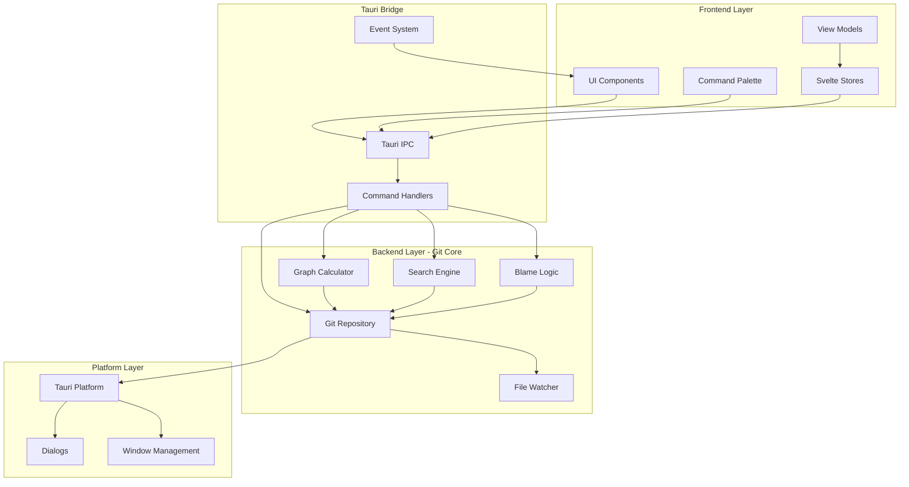
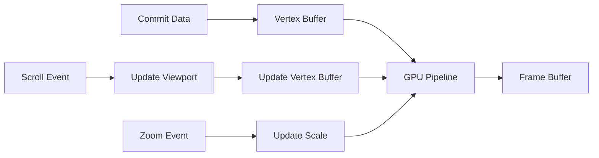

# Design Document: gitv

> **Note**: This is the active design document. The original React-based spec is preserved in `.kiro/specs/gitv/design.md`.

## Overview

gitv is a modern, cross-platform Git visualization tool built with Rust and Tauri. It serves as a contemporary reimplementation of gitk, providing an intuitive graphical interface for exploring Git repositories. Unlike gitk, which is typically launched from within a repository, gitv allows users to launch the application independently and open any Git project directory.

### Design Goals

1. **Performance First**: Handle repositories with 100,000+ commits smoothly with 60 FPS rendering
2. **Pure Rust**: Use Rust for all application code, preferring pure-Rust crates (especially gitoxide for Git operations)
3. **Modern UX**: Provide a polished, responsive experience with smooth animations and intuitive navigation
4. **Gitk Compatibility**: Maintain the dense, information-rich commit graph alignment that gitk users expect
5. **Decoupled Architecture**: Separate Git logic from UI for maintainability and testability

### Key Differentiators from gitk

- Independent application launch with repository picker
- Modern GPU-accelerated rendering
- Cross-platform consistency
- Streaming data loading for large repositories
- Command palette for quick navigation
- Filesystem watching with auto-refresh

---

## Architecture

### High-Level Architecture



### Layer Responsibilities

| Layer | Responsibility | Technology |
|-------|----------------|------------|
| Frontend | UI rendering, user interaction, state management | SvelteKit + TypeScript |
| Tauri Bridge | IPC communication, command routing, event broadcasting | Tauri 2.0 |
| Backend (Git Core) | Git operations, graph calculation, search, file watching | Rust + gix (gitoxide) |
| Platform | Native dialogs, window management, filesystem access | Tauri + OS APIs |

### Architectural Decisions

#### ADR-001: Decoupled Git Backend

**Decision**: The Git backend module is a completely separate Rust crate with no UI dependencies.

**Rationale**:
- Enables independent testing of Git logic (Req 23.4)
- Allows future replacement of the Git implementation (Req 23.6)
- Provides clean API boundaries (Req 23.2)
- No Tauri-specific dependencies in Git code (Req 23.5)

**Consequences**:
- Clear separation between `gitv-git-core` and `gitv-app` crates
- Git backend exposes trait-based interfaces for mocking in tests
- UI communicates only through well-defined data structures

#### ADR-002: Pure Rust Git Implementation

**Decision**: Use gitoxide (gix crate) as the primary Git library.

**Rationale**:
- Pure Rust implementation (Req 30.1, 30.3)
- Production-grade stability with active development
- Supports commit graph traversal, blame, status, and most read operations
- No external C library dependencies for core functionality

**Fallback**: If gitoxide lacks specific features, we may need to:
1. Contribute the feature upstream to gitoxide
2. Implement missing functionality directly in gitv
3. Shell out to `git` CLI as a last resort (clearly documented per Req 30.4)

#### ADR-003: GPU-Accelerated Graph Rendering

**Decision**: Use wgpu for GPU-accelerated commit graph rendering.

**Rationale**:
- Requirement for GPU-accelerated rendering (Req 24.1)
- Cross-platform: Vulkan, Metal, DirectX 12, WebGPU support
- Pure Rust with no C dependencies
- Works within Tauri window context

**Alternative Considered**: femtovg was considered but wgpu provides more control for custom graph rendering with virtualization.

#### ADR-004: Tab State Isolation (Req 31)

**Decision**: Each tab maintains isolated state with its own repository connection, scroll position, filters, and selections.

**Rationale**:
- Multiple repositories can be open simultaneously without state conflicts
- Tab state can be serialized independently for persistence
- Switching tabs is instant (no need to reload data)
- Memory efficient - only active tab needs full rendering resources

**Implementation**:
- `TabState` struct contains all per-tab state
- `TabSession` manages the collection of tabs
- On app close, `TabSession` is serialized to storage
- On app open, `TabSession` is deserialized and tabs restored

**Consequences**:
- Each tab holds Git repository connection and cached data
- Memory usage scales with number of open tabs
- Tab switching requires context switch in UI components

#### ADR-005: Branch View Filtering Architecture (Req 32)

**Decision**: Branch view filtering is implemented at the Git traversal layer, not the UI layer.

**Rationale**:
- Filtering at traversal layer ensures we never load unnecessary commits
- First-parent-only traversal is a pure Git operation
- UI remains responsive with pre-filtered data
- Consistent with existing streaming architecture

**Implementation**:
- `CommitFilter` struct extended with `branch_view_mode`
- First-parent-only uses `gix::traverse::commit::ancestors()` with `parents::first()` mode
- Single-branch mode uses reachability check from branch tip

#### ADR-006: SvelteKit Frontend

**Decision**: Use SvelteKit with Svelte 5 as the frontend framework, with static adapter for Tauri.

**Rationale**:
- Svelte compiles to vanilla JS — no runtime framework overhead
- Svelte 5 runes (`$state`, `$derived`, `$effect`, `$props`) provide fine-grained reactivity without virtual DOM
- Built-in stores eliminate need for external state management library
- SvelteKit provides file-based routing; static adapter produces a SPA for Tauri
- Smaller bundle size than React, important for desktop app startup time

**Consequences**:
- Frontend uses `+page.svelte` / `+layout.svelte` file conventions
- State lives in `src/lib/stores/` as Svelte stores (writable/readable/derived)
- Component props use `let { ... } = $props()` rune
- No virtual DOM diffing; Svelte updates DOM directly at compile time

---

## Components and Interfaces

### Backend Components (Rust)

#### Git Repository Module (`gitv-git-core::repository`)

```rust
/// Core repository abstraction - the main entry point for Git operations
pub struct Repository {
    inner: gix::Repository,
    path: PathBuf,
}

/// Repository information for display
pub struct RepositoryInfo {
    pub path: PathBuf,
    pub head_branch: Option<String>,
    pub head_commit: Option<Oid>,
    pub is_bare: bool,
    pub worktree_status: WorktreeStatus,
}

/// Worktree status summary
pub struct WorktreeStatus {
    pub staged_count: usize,
    pub unstaged_count: usize,
    pub ahead: usize,
    pub behind: usize,
}

impl Repository {
    /// Open a repository at the given path
    pub fn open(path: &Path) -> Result<Self, RepositoryError>;

    /// Check if a path contains a Git repository
    pub fn is_repository(path: &Path) -> bool;

    /// Get repository information
    pub fn info(&self) -> RepositoryInfo;

    /// Stream commits with optional filters
    pub fn stream_commits(&self, filter: CommitFilter) -> impl Stream<Item = Commit>;

    /// Get all refs (branches, tags, remotes)
    pub fn refs(&self) -> Result<Vec<Ref>, GitError>;

    /// Get commit details
    pub fn commit(&self, oid: Oid) -> Result<CommitDetails, GitError>;

    /// Get diff between commits
    pub fn diff(&self, from: Oid, to: Oid) -> Result<Diff, GitError>;

    /// Get file history/blame
    pub fn blame(&self, path: &Path) -> Result<Blame, GitError>;

    /// Search commits
    pub fn search(&self, query: SearchQuery) -> Result<Vec<SearchResult>, GitError>;
}
```

#### Graph Calculator Module (`gitv-git-core::graph`)

```rust
/// Calculates the visual layout of the commit graph
pub struct GraphCalculator {
    commits: Vec<CommitInfo>,
    refs: HashMap<Oid, Vec<Ref>>,
}

/// Node position in the graph (row = i-coordinate, column = j-coordinate)
pub struct NodePosition {
    pub commit_oid: Oid,
    pub row: usize,
    pub column: usize,
}

/// Edge between commits
pub struct Edge {
    pub from: Oid,
    pub to: Oid,
    pub edge_type: EdgeType,
    pub column: usize,
}

pub enum EdgeType {
    /// Direct parent-child relationship
    ParentChild,
    /// Merge edge (second parent)
    Merge,
}

/// Complete graph layout ready for rendering
pub struct GraphLayout {
    pub nodes: Vec<NodePosition>,
    pub edges: Vec<Edge>,
    pub max_column: usize,
    pub branch_colors: HashMap<String, Color>,
}

impl GraphCalculator {
    /// Create calculator from commit stream
    pub fn new(commits: Vec<CommitInfo>, refs: HashMap<Oid, Vec<Ref>>) -> Self;

    /// Calculate graph layout using temporal topological sort
    /// Based on algorithm from https://pvigier.github.io/2019/05/06/commit-graph-drawing-algorithms.html
    pub fn calculate_layout(&self) -> GraphLayout;

    /// Get visible portion of the graph for virtualization
    pub fn visible_range(&self, start_row: usize, end_row: usize) -> GraphViewport;
}
```

#### Search Engine Module (`gitv-git-core::search`)

```rust
/// Search query with multiple criteria
pub struct SearchQuery {
    pub text: Option<String>,
    pub sha_prefix: Option<String>,
    pub author: Option<String>,
    pub date_range: Option<DateRange>,
    pub file_path: Option<PathBuf>,
    pub diff_pattern: Option<Regex>,
    pub combine_mode: CombineMode,
}

pub enum CombineMode {
    And,
    Or,
}

/// Search result with match highlights
pub struct SearchResult {
    pub commit_oid: Oid,
    pub match_type: MatchType,
    pub highlights: Vec<Highlight>,
}

pub enum MatchType {
    Message,
    Sha,
    Author,
    Diff { file: PathBuf, line_number: usize },
}

pub struct Highlight {
    pub start: usize,
    pub length: usize,
}

impl SearchEngine {
    /// Create search engine for a repository
    pub fn new(repo: &Repository) -> Self;

    /// Execute search query
    pub fn search(&self, query: SearchQuery) -> Result<Vec<SearchResult>, SearchError>;

    /// Search within diffs/patches
    pub fn search_diffs(&self, pattern: &Regex) -> Result<Vec<DiffMatch>, SearchError>;
}
```

#### File Watcher Module (`gitv-git-core::watcher`)

```rust
/// Filesystem watcher for repository changes
pub struct RepositoryWatcher {
    watcher: Debouncer<RecommendedWatcher>,
    tx: Sender<WatchEvent>,
}

pub enum WatchEvent {
    RefsChanged,
    HeadChanged,
    IndexChanged,
    ObjectsChanged,
    WorkingTreeChanged,
}

impl RepositoryWatcher {
    /// Start watching a repository's .git directory
    pub fn start(repo_path: &Path, event_tx: Sender<WatchEvent>) -> Result<Self, WatchError>;

    /// Stop watching
    pub fn stop(self);
}

/// Configuration for debouncing
pub struct WatchConfig {
    /// Minimum time between events (default: 100ms)
    pub debounce_ms: u64,
    /// Which events to watch
    pub watch_mask: WatchMask,
}
```

#### Streaming Iterator Module (`gitv-git-core::stream`)

```rust
/// Streaming commit iterator for large repositories
pub struct CommitStream {
    repo: Repository,
    filter: CommitFilter,
    buffer_size: usize,
}

pub struct CommitFilter {
    pub refs: Option<Vec<String>>,
    pub date_range: Option<DateRange>,
    pub author: Option<String>,
    pub path: Option<PathBuf>,
}

impl CommitStream {
    /// Create a new stream with default buffer size
    pub fn new(repo: Repository, filter: CommitFilter) -> Self;

    /// Get next batch of commits
    pub fn next_batch(&mut self, count: usize) -> Option<Vec<CommitInfo>>;

    /// Check if stream has more commits
    pub fn has_more(&self) -> bool;

    /// Cancel the stream
    pub fn cancel(&mut self);
}
```

### Tauri Commands (IPC Interface)

```rust
// Commands exposed to the frontend via Tauri IPC

#[tauri::command]
async fn open_repository(path: String) -> Result<RepositoryInfo, String>;

#[tauri::command]
async fn get_recent_repositories() -> Result<Vec<RecentRepository>, String>;

#[tauri::command]
async fn stream_commits(
    repo_path: String,
    filter: CommitFilter,
    window: tauri::Window
) -> Result<(), String>;

#[tauri::command]
async fn get_commit(repo_path: String, oid: String) -> Result<CommitDetails, String>;

#[tauri::command]
async fn get_diff(
    repo_path: String,
    from: Option<String>,
    to: String
) -> Result<Diff, String>;

#[tauri::command]
async fn search_commits(
    repo_path: String,
    query: SearchQuery
) -> Result<Vec<SearchResult>, String>;

#[tauri::command]
async fn get_blame(
    repo_path: String,
    file_path: String
) -> Result<Blame, String>;

#[tauri::command]
async fn get_graph_layout(
    repo_path: String,
    commit_range: Option<CommitRange>
) -> Result<GraphLayout, String>;

#[tauri::command]
async fn watch_repository(
    repo_path: String,
    app: tauri::AppHandle
) -> Result<(), String>;
```

### Frontend Components (SvelteKit)

#### Route & Component Hierarchy

```
src/
├── app.html                          # HTML shell
├── app.css                           # Global Tailwind styles
├── routes/
│   ├── +layout.svelte                # Root layout (TabBar, global modals)
│   ├── +page.svelte                  # Welcome screen / main repo view
│   └── repository/
│       └── [path]/
│           └── +page.svelte          # Repository-specific page
├── lib/
│   ├── components/
│   │   ├── TabBar.svelte             (Req 31: multiple repository tabs)
│   │   ├── Tab.svelte
│   │   ├── NewTabButton.svelte
│   │   ├── WelcomeScreen.svelte      (shown when no repo is open)
│   │   │   ├── RecentReposList.svelte
│   │   │   └── OpenRepoButton.svelte
│   │   ├── MainLayout.svelte         (shown when repo is open)
│   │   ├── Sidebar/
│   │   │   ├── BranchList.svelte
│   │   │   ├── TagList.svelte
│   │   │   └── RemoteList.svelte
│   │   ├── Toolbar/
│   │   │   ├── SearchBar.svelte
│   │   │   ├── FilterControls.svelte
│   │   │   │   └── BranchViewToggle.svelte   (Req 32)
│   │   │   │       └── FirstParentToggle.svelte (Req 32.4)
│   │   │   ├── ViewToggle.svelte
│   │   │   └── FullscreenButton.svelte       (Req 33)
│   │   ├── CommitView/
│   │   │   ├── CommitGraph.svelte     (GPU-rendered via wgpu)
│   │   │   ├── CommitList.svelte      (Virtualized)
│   │   │   └── SynchronizedScroller.svelte
│   │   ├── DetailPanel/
│   │   │   ├── CommitDetails.svelte
│   │   │   ├── FileTree/
│   │   │   │   ├── FileTreeSearch.svelte  (Req 34)
│   │   │   │   └── FileList.svelte
│   │   │   └── DiffViewer.svelte
│   │   ├── StatusBar/
│   │   │   ├── BranchIndicator.svelte
│   │   │   ├── StatusIndicator.svelte
│   │   │   └── LoadingIndicator.svelte
│   │   ├── CommandPalette.svelte
│   │   ├── FullscreenOverlay.svelte   (Req 33)
│   │   │   ├── FullscreenHistoryView.svelte
│   │   │   └── FullscreenDiffView.svelte
│   │   └── Modals/
│   │       ├── SettingsModal.svelte
│   │       ├── KeyboardShortcutsModal.svelte
│   │       └── ErrorModal.svelte
│   ├── stores/
│   │   ├── app.ts                     # Global app state (Svelte stores)
│   │   ├── repository.ts             # Repository data store
│   │   ├── tabs.ts                    # Tab session store (Req 31)
│   │   └── ui.ts                     # UI preferences (theme, layout, fullscreen)
│   ├── actions/
│   │   ├── keyboard.ts               # Svelte actions for keyboard shortcuts
│   │   └── virtual-scroll.ts         # Svelte action for virtual scrolling
│   └── bindings/                      # Auto-generated Tauri IPC bindings
│       └── index.ts
```

#### Key UI Components

##### CommitGraph Component

The commit graph is the most complex UI component, requiring GPU acceleration and virtualization.

```svelte
<script lang="ts">
  import type { GraphLayout, Viewport } from "$lib/bindings";
  import type { Oid } from "$lib/bindings";

  let {
    layout,
    viewport,
    selectedCommit = $bindable(null),
    highlightedCommits = new Set<Oid>(),
    oncommitselect,
    oncommithover,
  }: {
    layout: GraphLayout;
    viewport: Viewport;
    selectedCommit?: Oid | null;
    highlightedCommits?: Set<Oid>;
    oncommitselect?: (oid: Oid) => void;
    oncommithover?: (oid: Oid | null) => void;
  } = $props();

  // Uses wgpu for rendering via canvas element
  // - Virtualized: only draws visible nodes/edges
  // - Caches rendered elements
  // - 60 FPS during pan/zoom
</script>

<canvas bind:this={canvasElement}></canvas>
```

##### CommitList Component

Virtualized list that stays synchronized with the graph.

```svelte
<script lang="ts">
  import type { CommitInfo } from "$lib/bindings";

  let {
    commits,
    selectedIndex = $bindable(0),
    visibleRange = [0, 50] as [number, number],
    onselectionchange,
    onscroll,
  }: {
    commits: CommitInfo[];
    selectedIndex?: number;
    visibleRange?: [number, number];
    onselectionchange?: (index: number) => void;
    onscroll?: (scrollTop: number) => void;
  } = $props();

  // Virtual scrolling for 100k+ commits
  // Row height matches graph node spacing for alignment
</script>
```

##### DiffViewer Component

```svelte
<script lang="ts">
  import type { Diff, DiffHighlight } from "$lib/bindings";

  let {
    diff,
    viewMode = "unified" as "unified" | "side-by-side",
    highlights = [] as DiffHighlight[],
    searchPattern,
  }: {
    diff: Diff;
    viewMode?: "unified" | "side-by-side";
    highlights?: DiffHighlight[];
    searchPattern?: RegExp;
  } = $props();

  // Syntax highlighting for diffs
  // Line numbers for both old/new versions
  // Search match highlighting
</script>
```

##### CommandPalette Component

```svelte
<script lang="ts">
  import type { RepositoryInfo } from "$lib/bindings";

  interface Command {
    id: string;
    label: string;
    shortcut?: string;
    action: () => void;
    category: string;
  }

  let {
    isOpen = $bindable(false),
    commands = [] as Command[],
    recentRepositories = [] as RepositoryInfo[],
    onclose,
  }: {
    isOpen?: boolean;
    commands?: Command[];
    recentRepositories?: RepositoryInfo[];
    onclose?: () => void;
  } = $props();

  // Fuzzy search across commands
  // Navigate to commits by SHA/message
  // Switch between repositories
</script>
```

---

## Data Models

### Core Data Structures

```rust
/// Unique object identifier (commit SHA)
pub type Oid = String;

// ===== Tab State Models (Req 31) =====

/// Unique tab identifier
pub type TabId = String;

/// Tab state for a single repository
pub struct TabState {
    pub id: TabId,
    pub repository_path: PathBuf,
    pub repository_name: String,
    pub display_name: String,  // Disambiguated name if duplicates exist
    pub parent_dir: Option<String>,
    pub scroll_position: u64,
    pub selected_commit: Option<Oid>,
    pub selected_file: Option<PathBuf>,
    pub filters: FilterState,
    pub branch_view_mode: BranchViewMode,
    pub file_tree_search: Option<String>,
    pub last_accessed: DateTime<Utc>,
}

/// Full tab session state for persistence
pub struct TabSession {
    pub tabs: Vec<TabState>,
    pub active_tab_id: Option<TabId>,
}

/// Branch view mode (Req 32)
pub struct BranchViewMode {
    pub mode: BranchViewModeType,
    pub selected_branch: Option<String>,
    pub first_parent_only: bool,
}

pub enum BranchViewModeType {
    All,
    Selected,
}

// ===== Fullscreen State (Req 33) =====

/// Fullscreen mode state
pub enum FullscreenMode {
    None,
    History,
    Diff,
}

// ===== File Tree Search State (Req 34) =====

/// File tree search configuration
pub struct FileTreeSearch {
    pub query: String,
    pub match_mode: FileTreeMatchMode,
}

pub enum FileTreeMatchMode {
    Exact,
    Fuzzy,
}

// ===== Core Git Models =====

/// Commit summary for list display
pub struct CommitInfo {
    pub oid: Oid,
    pub short_oid: String,
    pub message: String,
    pub summary: String,  // First line of message
    pub author: Author,
    pub committer: Author,
    pub author_time: DateTime<Utc>,
    pub commit_time: DateTime<Utc>,
    pub parent_oids: Vec<Oid>,
    pub refs: Vec<Ref>,
}

/// Full commit details
pub struct CommitDetails {
    pub info: CommitInfo,
    pub tree_oid: Oid,
    pub signature: Option<String>,
    pub changed_files: Vec<FileChange>,
    pub body: Option<String>,
}

/// Author information
pub struct Author {
    pub name: String,
    pub email: String,
}

/// Reference types
pub enum Ref {
    Branch(BranchRef),
    Tag(TagRef),
    Remote(RemoteRef),
    Head,
    Stash,
}

pub struct BranchRef {
    pub name: String,
    pub is_head: bool,
    pub is_remote: bool,
    pub upstream: Option<String>,
    pub ahead: usize,
    pub behind: usize,
}

pub struct TagRef {
    pub name: String,
    pub oid: Oid,
    pub annotation: Option<TagAnnotation>,
}

pub struct TagAnnotation {
    pub tagger: Author,
    pub message: String,
}

pub struct RemoteRef {
    pub name: String,
    pub remote: String,
}

/// File change in a commit
pub struct FileChange {
    pub path: PathBuf,
    pub old_path: Option<PathBuf>,  // For renames
    pub change_type: ChangeType,
    pub additions: usize,
    pub deletions: usize,
}

pub enum ChangeType {
    Added,
    Deleted,
    Modified,
    Renamed,
    Copied,
}

/// Diff representation
pub struct Diff {
    pub files: Vec<FileDiff>,
    pub stats: DiffStats,
}

pub struct FileDiff {
    pub path: PathBuf,
    pub old_path: Option<PathBuf>,
    pub hunks: Vec<Hunk>,
}

pub struct Hunk {
    pub old_start: usize,
    pub old_count: usize,
    pub new_start: usize,
    pub new_count: usize,
    pub lines: Vec<DiffLine>,
}

pub enum DiffLine {
    Context { content: String },
    Addition { content: String, old_line: Option<usize>, new_line: usize },
    Deletion { content: String, old_line: usize, new_line: Option<usize> },
}

pub struct DiffStats {
    pub files_changed: usize,
    pub additions: usize,
    pub deletions: usize,
}

/// Blame information
pub struct Blame {
    pub file_path: PathBuf,
    pub lines: Vec<BlameLine>,
}

pub struct BlameLine {
    pub line_number: usize,
    pub content: String,
    pub commit_oid: Oid,
    pub author: Author,
    pub time: DateTime<Utc>,
}

/// Search query
pub struct SearchQuery {
    pub text: Option<String>,
    pub sha_prefix: Option<String>,
    pub author: Option<String>,
    pub date_range: Option<DateRange>,
    pub file_path: Option<PathBuf>,
    pub diff_pattern: Option<String>,
    pub combine_mode: CombineMode,
}

pub struct DateRange {
    pub start: DateTime<Utc>,
    pub end: DateTime<Utc>,
}

pub enum CombineMode {
    And,
    Or,
}
```

### Frontend State Model

State is managed via Svelte stores in `src/lib/stores/`. Svelte 5 runes (`$state`, `$derived`, `$effect`) are used inside `.svelte.ts` store modules for fine-grained reactivity.

```typescript
// src/lib/stores/app.svelte.ts

// --- Global application state ---

// Tab state (Req 31)
let tabs = $state<TabState[]>([]);
let activeTabId = $state<string | null>(null);

// Repository state
let repository = $state<RepositoryState | null>(null);
let recentRepositories = $state<RecentRepository[]>([]);

// View state
let selectedCommit = $state<string | null>(null);
let selectedFile = $state<string | null>(null);
let viewMode = $state<"graph" | "list">("graph");
let diffViewMode = $state<"unified" | "side-by-side">("unified");

// Filter state
let searchQuery = $state<SearchQuery>(defaultSearchQuery);
let activeFilters = $state<FilterState>(defaultFilters);
let branchViewMode = $state<BranchViewMode>({ mode: "all", selectedBranch: null, firstParentOnly: false });

// Fullscreen state (Req 33)
let fullscreenMode = $state<"none" | "history" | "diff">("none");

// File tree search state (Req 34)
let fileTreeSearch = $state<string>("");
let fileTreeFilterActive = $derived(fileTreeSearch.length > 0);

// UI state
let theme = $state<"dark" | "light">("dark");
let sidebarWidth = $state<number>(250);
let detailPanelHeight = $state<number>(300);
let fontSize = $state<number>(14);

// Loading state
let isLoading = $state<boolean>(false);
let loadingProgress = $state<number>(0);

// Error state
let error = $state<ErrorInfo | null>(null);

// --- Derived state ---
let activeTab = $derived(tabs.find((t) => t.id === activeTabId) ?? null);

// --- Exported store accessors ---
export function getAppState() {
  return {
    get tabs() { return tabs; },
    get activeTabId() { return activeTabId; },
    get repository() { return repository; },
    // ... all state getters
  };
}
```

```typescript
// src/lib/stores/tabs.svelte.ts

// Tab state for multi-repository support (Req 31)
interface TabState {
  id: string;
  repositoryPath: string;
  repositoryName: string;
  displayName: string;
  parentDir?: string;
  isActive: boolean;
  scrollPosition: number;
  selectedCommit: string | null;
  selectedFile: string | null;
  filters: FilterState;
  branchViewMode: BranchViewMode;
  fileTreeSearch: string;
  lastAccessed: Date;
}

let tabSession = $state<{ tabs: TabState[]; activeTabId: string | null }>({
  tabs: [],
  activeTabId: null,
});

// Persist to storage on change
$effect(() => {
  persistTabSession(tabSession);
});

export function addTab(tab: TabState) { /* ... */ }
export function removeTab(tabId: string) { /* ... */ }
export function switchTab(tabId: string) { /* ... */ }
```

```typescript
// Types shared across stores

interface BranchViewMode {
  mode: "all" | "selected";
  selectedBranch: string | null;
  firstParentOnly: boolean;
}

interface RepositoryState {
  path: string;
  info: RepositoryInfo;
  commits: CommitInfo[];
  refs: Ref[];
  graphLayout: GraphLayout;
  status: WorktreeStatus;
}

interface FilterState {
  branches: string[];
  authors: string[];
  dateRange: DateRange | null;
  files: string[];
}
```

---

## Error Handling

### Error Categories

```rust
/// Top-level error type for the application
pub enum GitvError {
    /// Repository-related errors
    Repository(RepositoryError),
    /// Git operation errors
    Git(GitError),
    /// Search errors
    Search(SearchError),
    /// I/O errors
    Io(std::io::Error),
    /// UI rendering errors
    Render(RenderError),
    /// Configuration errors
    Config(ConfigError),
}

/// Repository-specific errors
pub enum RepositoryError {
    NotFound(PathBuf),
    NotAGitRepository(PathBuf),
    Corrupted(String),
    PermissionDenied(PathBuf),
    LockAcquisitionFailed(String),
}

/// Git operation errors
pub enum GitError {
    ObjectNotFound(Oid),
    InvalidObject(Oid),
    InvalidRef(String),
    RevisionNotFound(String),
    DiffFailed(String),
    BlameFailed(String),
    GraphTraversalFailed(String),
}

/// Search-specific errors
pub enum SearchError {
    InvalidRegex(String),
    IndexCorrupted,
    QueryTooComplex,
}
```

### Error Handling Strategy

1. **User-Facing Errors**: Display a clear, actionable error message in the UI
2. **Logging**: All errors are logged to a file for troubleshooting (Req 15.4)
3. **Graceful Degradation**: Application continues functioning when possible
4. **Recovery**: Provide retry options for transient failures (Req 15.3)

### Error Display Patterns

```rust
/// User-facing error message
pub struct UserError {
    pub title: String,
    pub message: String,
    pub details: Option<String>,
    pub actions: Vec<ErrorAction>,
}

pub enum ErrorAction {
    Retry,
    OpenLogs,
    ReportIssue,
    Dismiss,
}
```

---

## Testing Strategy

### Testing Approach Overview

This feature involves a GUI application with Git operations, GPU rendering, and cross-platform concerns. Property-based testing is appropriate for the pure logic components (graph algorithms, search, data transformations), while integration tests and E2E tests handle the UI and platform layers.

### Test Categories

| Category | Scope | Tools |
|----------|-------|-------|
| Property-based | Graph algorithms, search, data transformations | proptest |
| Unit Tests | Individual functions, edge cases | cargo test |
| Integration Tests | Git backend, IPC commands | cargo test + temp repositories |
| GPU Tests | Rendering correctness | wgpu validation |
| E2E Tests | Full user workflows | Tauri testing + Playwright |
| Performance Benchmarks | Load times, FPS, memory | criterion |

### Unit Tests

- Individual Rust functions and methods
- Edge cases in graph calculation algorithms
- Error handling paths
- Data structure validation

**Focus Areas**:
- Graph layout algorithm correctness
- Search query parsing and execution
- Diff generation and parsing
- State management in frontend (Svelte store tests)

### Integration Tests

- Git backend operations against real repositories
- Tauri IPC command handlers
- Filesystem watcher behavior
- Cross-platform path handling

**Test Repositories**:
- Small repository (< 100 commits)
- Large repository (100,000+ commits)
- Repository with complex merge history
- Repository with submodules
- Bare repository
- Corrupted repository (for error handling)

### Property-Based Tests

**Applicable for**:
- Graph layout algorithm (topological sort maintains order)
- Search results contain query terms
- Serialization round-trips
- Diff line counting
- Tab state persistence (Req 31)
- Single-branch filtering (Req 32)
- First-parent traversal (Req 32)
- File tree search filtering (Req 34)
- Tab title disambiguation (Req 31)

**Not applicable for**:
- GPU rendering (visual output)
- Tauri IPC (external service behavior)
- Filesystem watching (external service behavior)
- Fullscreen mode toggle (UI wiring)
- Tab switching keyboard shortcuts (UI wiring)

### E2E Tests

- Complete user workflows using Tauri's testing framework
- Keyboard navigation
- Search and filter workflows
- Repository switching
- Theme switching

### Performance Benchmarks

Based on Requirement 27, benchmarks must measure:

| Metric | Target | Repository Size |
|--------|--------|-----------------|
| Initial load | < 5s | 100k commits |
| Scroll FPS | 60 FPS | Any |
| Search latency | < 500ms | 100k commits |
| Memory usage | < 500MB | 100k commits |

---

## Performance Strategies

### Commit Graph Optimization

The commit graph is the most performance-critical component. The design uses several strategies to achieve 60 FPS with 100,000+ commits:

#### Temporal Topological Sort Algorithm

Based on research from [Pierre Vigier's commit graph algorithms](https://pvigier.github.io/2019/05/06/commit-graph-drawing-algorithms.html), we implement:

1. **Temporal Topological Sort**: Combines topological ordering with timestamp awareness
2. **Straight Branch Algorithm**: Keeps commits on the same branch in the same column
3. **Forbidden Index Calculation**: Prevents edge overlaps using interval trees

```
Time Complexity: O(n log n + m) where n = commits, m = edges
Space Complexity: O(n + m)
```

#### Virtualized Rendering

```rust
/// Viewport for virtualized graph rendering
pub struct GraphViewport {
    /// Visible row range
    pub rows: Range<usize>,
    /// All nodes in visible range
    pub nodes: Vec<NodePosition>,
    /// All edges that intersect visible range
    pub edges: Vec<Edge>,
}

impl GraphViewport {
    /// Calculate visible portion using interval tree
    /// O(k log m) where k = visible edges, m = total edges
    pub fn from_visible_range(
        layout: &GraphLayout,
        start_row: usize,
        end_row: usize
    ) -> Self;
}
```

#### GPU Rendering Pipeline



### Streaming Git Data

To support repositories with 100,000+ commits without blocking the UI:

```rust
/// Batch streaming configuration
pub struct StreamConfig {
    /// Commits per batch (default: 100)
    pub batch_size: usize,
    /// Prefetch ahead of visible area
    pub prefetch_count: usize,
    /// Background thread pool size
    pub thread_pool_size: usize,
}
```

**Implementation**:
1. Use `gix::Repository::commit_iter()` for efficient traversal
2. Spawn background thread for Git operations
3. Send batches via Tauri events to frontend
4. Frontend displays commits progressively

### Memory Management

```rust
/// Memory-bounded cache for commit data
pub struct CommitCache {
    /// Maximum entries
    capacity: usize,
    /// LRU cache of commit details
    cache: LruCache<Oid, CommitDetails>,
}

/// Cached graph layout with incremental updates
pub struct GraphCache {
    /// Base layout
    layout: GraphLayout,
    /// Incremental updates
    updates: Vec<GraphUpdate>,
    /// Last calculated row
    last_row: usize,
}
```

---

## Localization Architecture

### Localization Strategy

gitv supports multiple languages through a localization framework:

```rust
/// Supported languages
pub enum Language {
    English,
    SimplifiedChinese,
    Japanese,
    German,
    Spanish,
    French,
}

/// Localization provider trait
pub trait LocalizationProvider {
    fn translate(&self, key: &str, lang: Language) -> String;
    fn format_date(&self, date: DateTime<Utc>, lang: Language) -> String;
    fn format_number(&self, num: usize, lang: Language) -> String;
}
```

### Locale Files Structure

```
src/lib/locales/
├── en.json
├── zh-CN.json
├── ja.json
├── de.json
├── es.json
└── fr.json
```

### RTL Support

For right-to-left languages (Arabic, Hebrew - future support):

```typescript
interface LayoutConfig {
  direction: "ltr" | "rtl";
  textAlign: "left" | "right";
}
```

---

## Keyboard Navigation

### Default Shortcuts

| Action | Windows/Linux | macOS |
|--------|---------------|-------|
| Open Repository | Ctrl+O | Cmd+O |
| Search | Ctrl+F | Cmd+F |
| Command Palette | Ctrl+P | Cmd+P |
| Navigate Up | Up / K | Up / K |
| Navigate Down | Down / J | Down / J |
| Next Branch | ] | ] |
| Previous Branch | [ | [ |
| Toggle Sidebar | Ctrl+B | Cmd+B |
| Close | Escape | Escape |
| Quit | Ctrl+Q | Cmd+Q |
| Next Tab | Ctrl+Tab | Ctrl+Tab |
| Previous Tab | Ctrl+Shift+Tab | Ctrl+Shift+Tab |
| Toggle Fullscreen | Ctrl+M | Cmd+M |
| Exit Fullscreen | Escape | Escape |

### Tab Navigation Shortcuts (Req 31)

| Action | Windows/Linux | macOS |
|--------|---------------|-------|
| Next Tab | Ctrl+Tab | Ctrl+Tab |
| Previous Tab | Ctrl+Shift+Tab | Ctrl+Shift+Tab |
| Close Tab | Ctrl+W | Cmd+W |
| New Tab | Ctrl+T | Cmd+T |
| Switch to Tab 1-9 | Ctrl+1-9 | Cmd+1-9 |

### Fullscreen Shortcuts (Req 33)

| Action | Windows/Linux | macOS |
|--------|---------------|-------|
| Toggle History Fullscreen | Ctrl+M | Cmd+M |
| Toggle Diff Fullscreen | Ctrl+Shift+M | Cmd+Shift+M |
| Exit Fullscreen | Escape | Escape |

### Customizable Shortcuts

```rust
/// User-configurable keyboard shortcuts
pub struct KeyboardShortcuts {
    bindings: HashMap<Action, KeyBinding>,
}

pub struct KeyBinding {
    key: String,
    modifiers: Vec<Modifier>,
    platform: Option<Platform>,
}
```

---

## Accessibility

### Screen Reader Support

- All interactive elements have ARIA labels
- Commit list uses `aria-rowindex` and `aria-selected`
- Graph nodes have accessible descriptions
- Status bar announcements for state changes

### Keyboard Navigation

- Full keyboard navigation without mouse
- Focus indicators on all interactive elements
- Logical tab order through the interface
- Escape key to close dialogs/modals

### Visual Accessibility

- High contrast theme option
- Customizable font sizes
- Color is not the only indicator (icons, patterns)
- Respects system accessibility settings

---

## Technology Choices

### Core Stack

| Component | Technology | Rationale |
|-----------|------------|-----------|
| Application Framework | Tauri 2.0 | Small bundle size, native performance, Rust backend |
| Git Library | gix (gitoxide) | Pure Rust, production-grade, no C dependencies |
| GPU Rendering | wgpu | Cross-platform, pure Rust, WebGPU compatible |
| Filesystem Watching | notify + notify-debouncer-full | Pure Rust, cross-platform, debouncing support |
| Date/Time | chrono | Comprehensive timezone support |
| Serialization | serde | Rust standard for serialization |
| Async Runtime | tokio | Required for Tauri, well-supported |

### Frontend Stack

| Component | Technology | Rationale |
|-----------|------------|-----------|
| UI Framework | Svelte 5 | Compile-time reactivity, no virtual DOM, minimal runtime |
| App Framework | SvelteKit | File-based routing, static adapter for Tauri SPA |
| State Management | Svelte stores (built-in) | No external deps; `$state`/`$derived` runes for fine-grained reactivity |
| Virtual List | svelte-virtual-scroll-list | Handles 100k+ items, native Svelte integration |
| Styling | Tailwind CSS | Rapid UI development, dark/light themes |
| Build Tool | Vite | Fast HMR, SvelteKit default, Tauri integration |

**Alternatives Considered**:
- **React**: Larger runtime, virtual DOM overhead unnecessary for desktop app. Kept as original spec in `.kiro/specs/gitv/design.md`.
- **Leptos** (pure Rust frontend): Interesting for Rust-only stack, but weaker accessibility tooling and smaller component ecosystem than Svelte.

### Development Tools

| Tool | Purpose |
|------|---------|
| cargo-nextest | Faster test runner |
| criterion | Performance benchmarking |
| cargo-tarpaulin | Code coverage |
| Tauri DevTools | Debugging |

---

## Project Structure

```
gitv/
├── src-tauri/                    # Rust backend
│   ├── Cargo.toml
│   ├── src/
│   │   ├── main.rs               # Tauri entry point
│   │   ├── lib.rs
│   │   ├── commands/             # Tauri IPC commands
│   │   │   ├── mod.rs
│   │   │   ├── repository.rs
│   │   │   ├── commits.rs
│   │   │   ├── diff.rs
│   │   │   ├── search.rs
│   │   │   └── watch.rs
│   │   └── error.rs
│   └── tauri.conf.json
│
├── crates/                       # Separate Rust crates
│   └── gitv-git-core/           # Decoupled Git logic
│       ├── Cargo.toml
│       └── src/
│           ├── lib.rs
│           ├── repository.rs
│           ├── graph/
│           │   ├── mod.rs
│           │   ├── calculator.rs
│           │   ├── layout.rs
│           │   └── viewport.rs
│           ├── search/
│           │   ├── mod.rs
│           │   ├── engine.rs
│           │   └── index.rs
│           ├── stream/
│           │   ├── mod.rs
│           │   └── iterator.rs
│           ├── watcher/
│           │   ├── mod.rs
│           │   └── debouncer.rs
│           ├── models/
│           │   ├── mod.rs
│           │   ├── commit.rs
│           │   ├── diff.rs
│           │   ├── blame.rs
│           │   └── refs.rs
│           └── error.rs
│
├── src/                          # Frontend (SvelteKit)
│   ├── app.html                  # HTML shell
│   ├── app.css                   # Global styles (Tailwind)
│   ├── routes/
│   │   ├── +layout.svelte        # Root layout
│   │   └── +page.svelte          # Main page
│   ├── lib/
│   │   ├── components/           # Svelte components
│   │   │   ├── CommitGraph/
│   │   │   ├── CommitList/
│   │   │   ├── DiffViewer/
│   │   │   ├── CommandPalette/
│   │   │   ├── Sidebar/
│   │   │   └── common/
│   │   ├── stores/               # Svelte stores (app, repository, tabs, ui)
│   │   ├── actions/              # Svelte actions (keyboard, virtual-scroll)
│   │   ├── bindings/             # Auto-generated from Tauri
│   │   ├── locales/              # i18n JSON files
│   │   └── types/                # Shared TypeScript types
│   └── svelte.config.js          # SvelteKit config (static adapter)
│
├── static/                       # Static assets
│
├── tests/                        # Integration tests
│   ├── fixtures/                 # Test repositories
│   └── e2e/                      # E2E tests
│
├── benches/                      # Performance benchmarks
│   ├── graph_layout.rs
│   ├── search.rs
│   └── load_time.rs
│
├── svelte.config.js              # SvelteKit config
├── vite.config.ts                # Vite config
├── tailwind.config.ts            # Tailwind config
├── tsconfig.json
├── package.json
└── mise.toml                     # Toolchain (npm)
```

---

## Implementation Phases

### Phase 1: Core Infrastructure
- Project setup with Tauri 2.0 + SvelteKit (static adapter)
- gitv-git-core crate structure
- Repository opening and basic info display
- Commit streaming with gitoxide

### Phase 2: Graph and Visualization
- Graph layout algorithm implementation
- wgpu rendering pipeline
- Virtualized commit list (Svelte action)
- Synchronized scrolling (Req 28)

### Phase 3: Search and Navigation
- Search engine implementation
- Command palette
- Keyboard navigation
- Filter controls

### Phase 4: Details and Diff
- Commit detail panel
- Diff viewer with unified/side-by-side modes
- File history and blame

### Phase 5: Polish and Performance
- GPU optimization
- Performance benchmarks
- Accessibility audit
- Localization

### Phase 6: Cross-Platform and Release
- Platform-specific testing
- CI/CD pipeline
- Documentation
- Release packaging

---

## Correctness Properties

*A property is a characteristic or behavior that should hold true across all valid executions of a system—essentially, a formal statement about what the system should do. Properties serve as the bridge between human-readable specifications and machine-verifiable correctness guarantees.*

### Property 1: Graph Layout Topological Order

*For any* commit graph, the layout algorithm shall produce a node ordering where every parent commit appears at a higher row index than its children (edges go upward).

**Validates: Requirements 4.2**

### Property 2: Graph Layout Completeness

*For any* set of commits, the graph layout shall contain exactly one node for each commit and one edge for each parent-child relationship.

**Validates: Requirements 4.2**

### Property 3: Branch Continuity

*For any* branch (sequence of commits where each is the first parent of the next), all commits on that branch shall be placed on the same column when using the straight-branch algorithm.

**Validates: Requirements 3.2**

### Property 4: Commit Information Completeness

*For any* valid commit in a repository, the `CommitInfo` structure shall contain a valid SHA, non-empty author name, valid timestamp, and commit message.

**Validates: Requirements 2.2**

### Property 5: Search Result Validity

*For any* search query and list of commits, all returned results shall satisfy the search criteria (text match in message, SHA prefix, author match, or date range).

**Validates: Requirements 6.2, 6.3, 6.4, 6.5**

### Property 6: Diff Search Correctness

*For any* regex pattern and diff, the search shall return all lines that match the pattern in added or removed content, with correct line positions.

**Validates: Requirements 6.8, 6.12**

### Property 7: Combined Search Correctness

*For any* combined search query with multiple criteria, results shall satisfy all criteria when using AND mode, or at least one criterion when using OR mode.

**Validates: Requirements 6.10**

### Property 8: Blame Line Accuracy

*For any* file at a specific commit, the blame output shall map each line to the commit that last modified that line.

**Validates: Requirements 7.2**

### Property 9: File Content at Commit

*For any* commit and file path that existed at that commit, retrieving the file content shall return exactly the content as it existed at that commit.

**Validates: Requirements 7.5**

### Property 10: Branch Commit Reachability

*For any* branch selection, all returned commits shall be reachable from the branch tip.

**Validates: Requirements 3.3**

### Property 11: Local vs Remote Branch Distinction

*For any* branch reference, the `is_remote` field shall be true if and only if the branch is a remote-tracking branch (refs/remotes/*).

**Validates: Requirements 3.5**

### Property 12: Changed Files Accuracy

*For any* commit, the `changed_files` list shall contain exactly the files that were modified in that commit (added, deleted, modified, renamed, or copied).

**Validates: Requirements 5.1**

### Property 13: Diff Between Commits

*For any* two commits A and B, the diff shall contain exactly the changes between the tree states of A and B.

**Validates: Requirements 5.6**

### Property 14: Tag-Commit Association

*For any* tag, the associated commit OID shall correctly identify the commit the tag points to.

**Validates: Requirements 8.3, 8.4**

### Property 15: All Refs Retrieved

*For any* repository, the refs query shall return all branches, tags, and remote refs present in the repository.

**Validates: Requirements 3.1, 8.1**

### Property 16: Glob Pattern Matching

*For any* glob pattern and list of ref names, the matching function shall return exactly the refs whose names match the pattern according to standard glob semantics.

**Validates: Requirements 19.1, 19.2, 19.3**

### Property 17: Revision Range Filtering

*For any* revision range A..B, the filtered commits shall be exactly the commits reachable from B but not from A.

**Validates: Requirements 17.2**

### Property 18: Ancestry Path Correctness

*For any* two commits A and B where B is an ancestor of A, the ancestry path shall contain exactly the commits on the direct path from A to B (including both endpoints).

**Validates: Requirements 20.1, 20.2**

### Property 19: Merge Conflict Detection

*For any* repository state, `has_conflicts()` shall return true if and only if there are unresolved merge conflicts (MERGE_HEAD exists with conflicting index entries).

**Validates: Requirements 18.1**

### Property 20: Conflict Branch Commits

*For any* merge conflict, the commits identified as "on each side" shall correctly partition commits unique to HEAD vs MERGE_HEAD branches.

**Validates: Requirements 18.2, 18.3**

### Property 21: Line Range History

*For any* file and line range, the returned commits shall all have modified at least one line in the specified range.

**Validates: Requirements 16.1, 16.3**

### Property 22: Sorting Correctness

*For any* list of commits, sorting by date/author/SHA shall produce a correctly ordered list where each element is less than or equal to the next according to the sort key.

**Validates: Requirements 2.4**

### Property 23: Filtering Correctness

*For any* list of commits and filter criteria, all filtered results shall satisfy the filter criteria.

**Validates: Requirements 2.5**

### Property 24: HEAD Branch Identification

*For any* repository, the HEAD branch name shall correctly identify the currently checked-out branch, or indicate detached HEAD state.

**Validates: Requirements 12.1**

### Property 25: Ahead/Behind Calculation

*For any* branch with an upstream, the ahead count shall equal the number of commits in the branch not in the upstream, and the behind count shall equal the number of commits in the upstream not in the branch.

**Validates: Requirements 12.3**

### Property 26: Path Handling Cross-Platform

*For any* file path string with forward slashes or backslashes, normalization shall produce a consistent internal representation regardless of the current platform.

**Validates: Requirements 9.6**

### Property 27: Locale Date Formatting

*For any* timestamp and locale, the formatted date string shall follow the date/time formatting conventions of that locale.

**Validates: Requirements 21.7**

### Property 28: Debounce Correctness

*For any* sequence of filesystem events within the debounce window, only one refresh event shall be emitted after the debounce period expires.

**Validates: Requirements 22.4**

### Property 29: Tab Title Correctness

*For any* repository info and set of open tabs, the tab title rendering shall display the repository name, with parent directory disambiguation when multiple tabs have the same repository name.

**Validates: Requirements 31.2, 31.3**

### Property 30: Tab State Persistence Round-Trip

*For any* valid tab session state, serializing to storage and deserializing shall produce an equivalent tab session with all repository paths, selections, and filters preserved.

**Validates: Requirements 31.5**

### Property 31: Single-Branch Filtering Correctness

*For any* branch and repository, single-branch filtering shall return exactly the commits reachable from the branch tip.

**Validates: Requirements 32.1**

### Property 32: First-Parent Traversal Correctness

*For any* branch and repository, first-parent-only traversal shall return only commits on the first-parent chain from the branch tip.

**Validates: Requirements 32.3**

### Property 33: Fullscreen UI Element Hiding

*For any* UI state in fullscreen mode, the rendered output shall not contain sidebar, status bar, or other non-essential UI elements.

**Validates: Requirements 33.3**

### Property 34: File Tree Search Correctness

*For any* file tree and search query (exact or fuzzy), filtering shall return only files whose paths match according to the specified matching mode.

**Validates: Requirements 34.2, 34.3**

### Property Reflection

After reviewing all properties, the following consolidations were identified:

1. **Properties 5, 6, 7** (Search) could be combined into a single comprehensive "Search Correctness" property, but they are kept separate because they test different search modes (basic, diff, combined).

2. **Properties 16, 17** (Glob and Range) are distinct filtering operations and remain separate.

3. **Properties 2, 3** (Graph Layout) test different aspects of the layout algorithm - completeness vs branch continuity - and are both needed.

4. **Properties 20, 21** (Conflict and Line Range) address different features and should remain separate.

No redundant properties were found that would be subsumed by others. Each property provides unique validation value for the gitv feature set.

---

## References

### Research Sources

1. [Gitoxide (gix) Repository](https://github.com/GitoxideLabs/gitoxide) - Pure Rust Git implementation
2. [Commit Graph Drawing Algorithms](https://pvigier.github.io/2019/05/06/commit-graph-drawing-algorithms.html) - Pierre Vigier's algorithm research
3. [Git Commit-Graph Design](https://raw.githubusercontent.com/git/git/master/Documentation/technical/commit-graph.adoc) - Git's internal commit-graph format
4. [wgpu - Cross-platform GPU API](https://wgpu.rs/) - GPU rendering in pure Rust
5. [notify crate](https://lib.rs/crates/notify) - Cross-platform filesystem watching

### Technology Documentation

- [Tauri 2.0 Documentation](https://tauri.app/)
- [gix crate documentation](https://docs.rs/gix/)
- [wgpu documentation](https://docs.rs/wgpu/)
- [chrono documentation](https://docs.rs/chrono/)
- [Svelte 5 Documentation](https://svelte-5-preview.vercel.app/)
- [SvelteKit Documentation](https://kit.svelte.dev/)
